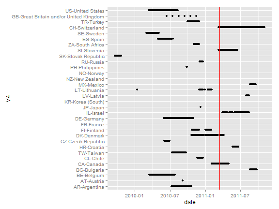
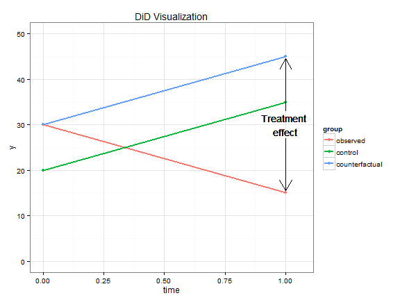

# Measuring and analysing the causal impact of the Fukushima Daiichi nuclear disaster


```r
library(knitr)
opts_chunk$set(comment = NA, fig.width = 8, fig.height = 6)
```


## Data

We use the International Social Survey Program (ISSP) data 2010 which added an environmental attitudes survey as a survey focus. The survey was conducted between 2010 and 2011 whereby the exact period varies by country. Data needs to be downloaded from ZACAT <http://zacat.gesis.org/webview/>.


```r
library(foreign)
setwd("C:/Users/Hackstutz/Dropbox/Fukushima/")
```

```
Error: kann Arbeitsverzeichnis nicht wechseln
```

```r
setwd("C:/Users/rudi/Dropbox/Fukushima/")
issp <- read.dta("issp_data/ZA5500_v2-0-0.dta")
```

```
Warning: duplicated levels in factors are deprecated
Warning: duplicated levels in factors are deprecated
Warning: duplicated levels in factors are deprecated
```


For a few countries we have information about the month the interview took place but not the exact day. We suggest to impute these information using random uniform distributions.


```r
# random.org
set.seed(950075)

issp$randomDY <- NULL
howmany31 <- length(which(issp$DATEMO %in% c("January", "March", "May", "July", 
    "August", "October", "December")))
howmany30 <- length(which(issp$DATEMO %in% c("April", "June", "September", "November")))
howmany28 <- length(which(issp$DATEMO %in% c("February")))
# Plus cases missing DATEMO Sums to N (45199)

# Create random days that can be used to fill Missings
issp$randomDY[issp$DATEMO %in% c("January", "March", "May", "July", "August", 
    "October", "December")] <- floor(runif(howmany31, 1, 32))
issp$randomDY[issp$DATEMO %in% c("April", "June", "September", "November")] <- floor(runif(howmany30, 
    1, 31))
issp$randomDY[issp$DATEMO %in% c("February")] <- floor(runif(howmany28, 1, 29))

# Fill where the value of DATEDY is missing:
issp$DATEDY[is.na(issp$DATEDY)] <- issp$randomDY[is.na(issp$DATEDY)]

# Create a nice data variable
levels(issp$DATEYR) <- c("2009", "2010", "2011", "No answer")
issp$datestring <- paste(issp$DATEYR, issp$DATEMO, issp$DATEDY, sep = "-")
# Change the locale to apply strptime with english names for months
Sys.setlocale("LC_TIME", "us")
```

```
[1] "English_United States.1252"
```

```r
issp$date <- strptime(issp$datestring, format = "%Y-%B-%d")
# issp$V4[is.na(issp$date)] #6471 Missings

# dependent variable
issp$nuclear <- 5 - as.numeric(issp$V45)
issp$nuclear[issp$nuclear %in% c("Can't choose", "NA")] <- NA
issp$nuclear <- factor(issp$nuclear)

# independent variable: before/after fukushima
fukushima <- strptime("2011-03-13", format = "%Y-%m-%d")
issp$after <- issp$date >= fukushima

# controls
issp$country <- issp$V4
issp$sex <- factor(issp$SEX)
issp$age <- issp$AGE/10
# issp$income <- issp$
issp$trust <- as.numeric(issp$V11) + as.numeric(issp$V12)
issp$pol_trust <- 5 - as.numeric(issp$V13)
```


It is important to know which countries contribute information to which period of time.


```r
library(ggplot2)

ggplot(issp, aes(x = date, y = V4)) + geom_point() + geom_vline(xintercept = as.numeric(fukushima), 
    color = "red")
```

```
Warning: Removed 6481 rows containing missing values (geom_point).
```

 


## Method

### Regression Discontinuity Design (RDD)

RDD's causal identification strategy is to compare cases which are very close to a certain cutoff point of threshold which assigns data into a control and treatment group. Concerning the Fukushima accident, the assignment variable is time and the threshold is the day of the accident: 13th March 2011. Whether the interview was conducted before the 13th or after appears to be random so comparing individuals surveyed just before and just after the accident does control for most unobserved heterogeneity. RDD is illustrated in the following figure:


```r
library(ggplot2)
library(grid)  #for function arrow()
x <- 1:100
set.seed(123)
y <- rnorm(100)
y[50:100] <- y[50:100] + 2
group <- c(rep(0, 50), rep(1, 50))
qplot(x, y, group = group) + stat_smooth(se = FALSE) + geom_text(show_guide = FALSE, 
    x = 50, y = 1.2, label = "Treatment \neffect", color = "black") + geom_segment(aes(x = 50, 
    y = 1.5, xend = 50, yend = 2.2), arrow = arrow(), color = "black") + geom_segment(aes(x = 50, 
    y = 0.8, xend = 50, yend = 0.45), arrow = arrow(), color = "black") + ggtitle("RDD Visualization") + 
    theme_bw()
```

```
geom_smooth: method="auto" and size of largest group is <1000, so using loess. Use 'method = x' to change the smoothing method.
```

 


### Difference-in-Difference Estimator (DiD)

DiD's causal identification strategy is to get rid of multiple sources of unobserved heterogeneity by controlling for country-characteristics (country dummies) and period-characteristics (period dummies) which in our case is accomplished by estimating a Country-Fixed-Effects Modell including a "before/after-Fukushima-Dummy". There are two key assumptions to mention. First, DiD assumes the timetrend of $y$, i.e. attitudes towards nuclear energy to be stable over time. Second, as there are countries which are completely before or completely after the accident, the covariance of all variables needs to be stable accross countries. (das müssen wir noch diskutieren). DiD is illustrated in the next figure:


```r
time <- rep(c(0, 1), 3)
observed <- c(30, 15)
control <- c(20, 35)
counterfactual <- c(30, 45)
group <- factor(c(1, 1, 2, 2, 3, 3), labels = c("observed", "control", "counterfactual"))
y <- c(observed, control, counterfactual)
qplot(time, y, group = group, colour = group, ylim = c(0, 50), xlim = c(0, 1.06)) + 
    geom_line(size = 1) + ggtitle("DiD Visualization") + geom_segment(aes(x = 1, 
    y = 27, xend = 1, yend = 15.5), arrow = arrow(), color = "black") + geom_segment(aes(x = 1, 
    y = 33, xend = 1, yend = 44.5), arrow = arrow(), color = "black") + geom_text(show_guide = FALSE, 
    x = 1, y = 30, label = "Treatment \neffect", color = "black") + theme_bw()
```

 


## Models

### RDD


```r
library(rdd)
# Efficiency gains can be made by including covariates. I.e. country
# dummies. Good to think about a lot more...  not yet working. bandwidth too
# small RDestimate(V45~as.numeric(date),
# cutpoint=as.numeric(fukushima),data=issp) plot(RDestimate(y~x|cov))
```


### DiD

Question: do we need ordered logit here because of potential compression effects (i.e. groups that had radical opinions BEFORE fukushima are not able to change there attitude. Image all women answered "very dangerous" before fukushima. then we can not observe an effect afterwards). 

We can answer that with a simulation using plausible numbers (obtained from the later analyses)


```r
library(MASS)
woman <- rbinom(36342, 1, 0.5)
# introduce an effect for sex (-0.33) and after (-0.21) but no interaction
y_star <- woman * -0.33 + rnorm(36342)
# retrieve cut-off-points
q20 <- quantile(y_star, 0.2)
q40 <- quantile(y_star, 0.4)
q60 <- quantile(y_star, 0.6)
q80 <- quantile(y_star, 0.8)
# introduce the fukushima effect
after <- rbinom(36342, 1, 0.5)
y_star <- y_star - 0.21 * after
y <- ifelse(y_star < q20, 1, ifelse(y_star < q40, 2, ifelse(y_star < q60, 3, 
    ifelse(y_star < q80, 4, 5))))
summary(lm(y ~ woman * after))
```

```

Call:
lm(formula = y ~ woman * after)

Residuals:
    Min      1Q  Median      3Q     Max 
-2.2285 -1.2285  0.0734  1.2404  2.4824 

Coefficients:
            Estimate Std. Error t value Pr(>|t|)    
(Intercept)   3.2285     0.0145  222.73   <2e-16 ***
woman        -0.4689     0.0206  -22.71   <2e-16 ***
after        -0.3019     0.0205  -14.76   <2e-16 ***
woman:after   0.0599     0.0291    2.06     0.04 *  
---
Signif. codes:  0 '***' 0.001 '**' 0.01 '*' 0.05 '.' 0.1 ' ' 1

Residual standard error: 1.39 on 36338 degrees of freedom
Multiple R-squared:  0.0335,	Adjusted R-squared:  0.0334 
F-statistic:  420 on 3 and 36338 DF,  p-value: <2e-16
```

```r
summary(polr(as.factor(y) ~ woman * after))
```

```

Re-fitting to get Hessian
```

```
Call:
polr(formula = as.factor(y) ~ woman * after)

Coefficients:
              Value Std. Error t value
woman       -0.5933     0.0265  -22.41
after       -0.3822     0.0261  -14.62
woman:after  0.0705     0.0372    1.89

Intercepts:
    Value   Std. Error t value
1|2  -1.695   0.021    -80.180
2|3  -0.710   0.020    -36.329
3|4   0.121   0.019      6.304
4|5   1.131   0.020     55.157

Residual Deviance: 115391.99 
AIC: 115405.99 
```


We see a bias if we use -2 for women (so there must be an extreme base line difference for this artefact to occure). ologit solves the problem but there is no need to use it. For our FE model it is better to stick to metric assumptions.


```r
# We need ordered logit regression here. Fixed effects can be achieved by
# including country-dummies.
library(MASS)
# including country dummies in polr() throws an error..
# summary(polr(nuclear~after*(sex+age), data=issp))

# using OLS vs ordered logit seems legit (see simulation)

# Model without interactions to get the gross effect
summary(lm(as.numeric(nuclear) ~ after + sex + age + DEGREE + trust + pol_trust + 
    country + DATEMO * DATEYR, data = issp))
```

```

Call:
lm(formula = as.numeric(nuclear) ~ after + sex + age + DEGREE + 
    trust + pol_trust + country + DATEMO * DATEYR, data = issp)

Residuals:
   Min     1Q Median     3Q    Max 
-3.637 -0.649  0.065  0.793  2.512 

Coefficients: (13 not defined because of singularities)
                                                                                       Estimate
(Intercept)                                                                             4.35111
afterTRUE                                                                               0.15097
sexFemale                                                                               0.29851
age                                                                                    -0.02787
DEGREELowest formal qualification                                                      -0.01386
DEGREEIntermediate secondary completed (qualifications above the lowest qualification)  0.00851
DEGREEHigher secondary completed (usual entry requirements for universities)           -0.06414
DEGREEUniversity degree incomplete (qualifications above higher secondary level)       -0.09690
DEGREEUniversity degree completed, BG: lower tertiary level, upper tertiary level      -0.19453
trust                                                                                  -0.03324
pol_trust                                                                              -0.04620
countryAT-Austria                                                                       0.32689
countryBE-Belgium                                                                      -0.69639
countryBG-Bulgaria                                                                     -0.11054
countryCA-Canada                                                                       -0.41827
countryCL-Chile                                                                         0.23763
countryTW-Taiwan                                                                       -0.39388
countryHR-Croatia                                                                       0.17593
countryCZ-Czech Republic                                                               -1.08617
countryDK-Denmark                                                                      -0.56962
countryFI-Finland                                                                      -0.52123
countryDE-Germany                                                                      -0.12979
countryIL-Israel                                                                        0.18303
countryJP-Japan                                                                        -0.62410
countryLV-Latvia                                                                        0.19127
countryLT-Lithuania                                                                    -0.27279
countryMX-Mexico                                                                        0.43635
countryPH-Philippines                                                                   0.12100
countryRU-Russia                                                                        0.02897
countrySK-Slovak Republic                                                              -0.43387
countrySI-Slovenia                                                                     -0.18795
countryZA-South Africa                                                                 -0.00146
countryES-Spain                                                                        -0.19604
countrySE-Sweden                                                                       -1.06169
countryCH-Switzerland                                                                   0.20150
countryTR-Turkey                                                                        0.29626
countryGB-Great Britain and/or United Kingdom                                          -0.83084
countryUS-United States                                                                -0.64588
DATEMOFebruary                                                                         -0.17884
DATEMOMarch                                                                            -0.05489
DATEMOApril                                                                            -0.04663
DATEMOMay                                                                              -0.07066
DATEMOJune                                                                             -0.08702
DATEMOJuly                                                                             -0.30481
DATEMOAugust                                                                           -0.40505
DATEMOSeptember                                                                        -0.22356
DATEMOOctober                                                                          -0.14251
DATEMONovember                                                                         -0.06137
DATEMODecember                                                                         -0.09032
DATEYR2010                                                                              0.01119
DATEYR2011                                                                                   NA
DATEMOFebruary:DATEYR2010                                                                    NA
DATEMOMarch:DATEYR2010                                                                  0.11024
DATEMOApril:DATEYR2010                                                                  0.08542
DATEMOMay:DATEYR2010                                                                    0.09087
DATEMOJune:DATEYR2010                                                                   0.05869
DATEMOJuly:DATEYR2010                                                                   0.26110
DATEMOAugust:DATEYR2010                                                                 0.46549
DATEMOSeptember:DATEYR2010                                                              0.19822
DATEMOOctober:DATEYR2010                                                                0.01393
DATEMONovember:DATEYR2010                                                               0.01131
DATEMODecember:DATEYR2010                                                                    NA
DATEMOFebruary:DATEYR2011                                                                    NA
DATEMOMarch:DATEYR2011                                                                       NA
DATEMOApril:DATEYR2011                                                                       NA
DATEMOMay:DATEYR2011                                                                         NA
DATEMOJune:DATEYR2011                                                                        NA
DATEMOJuly:DATEYR2011                                                                        NA
DATEMOAugust:DATEYR2011                                                                      NA
DATEMOSeptember:DATEYR2011                                                             -0.08237
DATEMOOctober:DATEYR2011                                                                     NA
DATEMONovember:DATEYR2011                                                                    NA
DATEMODecember:DATEYR2011                                                                    NA
                                                                                       Std. Error
(Intercept)                                                                               0.10051
afterTRUE                                                                                 0.09086
sexFemale                                                                                 0.01098
age                                                                                       0.00340
DEGREELowest formal qualification                                                         0.02758
DEGREEIntermediate secondary completed (qualifications above the lowest qualification)    0.02648
DEGREEHigher secondary completed (usual entry requirements for universities)              0.02606
DEGREEUniversity degree incomplete (qualifications above higher secondary level)          0.02852
DEGREEUniversity degree completed, BG: lower tertiary level, upper tertiary level         0.02771
trust                                                                                     0.00282
pol_trust                                                                                 0.00532
countryAT-Austria                                                                         0.04993
countryBE-Belgium                                                                         0.06735
countryBG-Bulgaria                                                                        0.17213
countryCA-Canada                                                                          0.15252
countryCL-Chile                                                                           0.09307
countryTW-Taiwan                                                                          0.04757
countryHR-Croatia                                                                         0.16246
countryCZ-Czech Republic                                                                  0.06706
countryDK-Denmark                                                                         0.08892
countryFI-Finland                                                                         0.08776
countryDE-Germany                                                                         0.04691
countryIL-Israel                                                                          0.16216
countryJP-Japan                                                                           0.10014
countryLV-Latvia                                                                          0.16982
countryLT-Lithuania                                                                       0.09830
countryMX-Mexico                                                                          0.17013
countryPH-Philippines                                                                     0.04791
countryRU-Russia                                                                          0.09918
countrySK-Slovak Republic                                                                 0.27792
countrySI-Slovenia                                                                        0.15795
countryZA-South Africa                                                                    0.09052
countryES-Spain                                                                           0.06614
countrySE-Sweden                                                                          0.08388
countryCH-Switzerland                                                                     0.15793
countryTR-Turkey                                                                          0.08358
countryGB-Great Britain and/or United Kingdom                                             0.05443
countryUS-United States                                                                   0.06536
DATEMOFebruary                                                                            0.13536
DATEMOMarch                                                                               0.14929
DATEMOApril                                                                               0.16128
DATEMOMay                                                                                 0.16204
DATEMOJune                                                                                0.16287
DATEMOJuly                                                                                0.16635
DATEMOAugust                                                                              0.16991
DATEMOSeptember                                                                           0.27203
DATEMOOctober                                                                             0.26449
DATEMONovember                                                                            1.02426
DATEMODecember                                                                            1.01240
DATEYR2010                                                                                1.01334
DATEYR2011                                                                                     NA
DATEMOFebruary:DATEYR2010                                                                      NA
DATEMOMarch:DATEYR2010                                                                    1.02898
DATEMOApril:DATEYR2010                                                                    1.03026
DATEMOMay:DATEYR2010                                                                      1.03002
DATEMOJune:DATEYR2010                                                                     1.02976
DATEMOJuly:DATEYR2010                                                                     1.02976
DATEMOAugust:DATEYR2010                                                                   1.03036
DATEMOSeptember:DATEYR2010                                                                1.05207
DATEMOOctober:DATEYR2010                                                                  1.04717
DATEMONovember:DATEYR2010                                                                 1.44021
DATEMODecember:DATEYR2010                                                                      NA
DATEMOFebruary:DATEYR2011                                                                      NA
DATEMOMarch:DATEYR2011                                                                         NA
DATEMOApril:DATEYR2011                                                                         NA
DATEMOMay:DATEYR2011                                                                           NA
DATEMOJune:DATEYR2011                                                                          NA
DATEMOJuly:DATEYR2011                                                                          NA
DATEMOAugust:DATEYR2011                                                                        NA
DATEMOSeptember:DATEYR2011                                                                0.23162
DATEMOOctober:DATEYR2011                                                                       NA
DATEMONovember:DATEYR2011                                                                      NA
DATEMODecember:DATEYR2011                                                                      NA
                                                                                       t value
(Intercept)                                                                              43.29
afterTRUE                                                                                 1.66
sexFemale                                                                                27.20
age                                                                                      -8.21
DEGREELowest formal qualification                                                        -0.50
DEGREEIntermediate secondary completed (qualifications above the lowest qualification)    0.32
DEGREEHigher secondary completed (usual entry requirements for universities)             -2.46
DEGREEUniversity degree incomplete (qualifications above higher secondary level)         -3.40
DEGREEUniversity degree completed, BG: lower tertiary level, upper tertiary level        -7.02
trust                                                                                   -11.79
pol_trust                                                                                -8.68
countryAT-Austria                                                                         6.55
countryBE-Belgium                                                                       -10.34
countryBG-Bulgaria                                                                       -0.64
countryCA-Canada                                                                         -2.74
countryCL-Chile                                                                           2.55
countryTW-Taiwan                                                                         -8.28
countryHR-Croatia                                                                         1.08
countryCZ-Czech Republic                                                                -16.20
countryDK-Denmark                                                                        -6.41
countryFI-Finland                                                                        -5.94
countryDE-Germany                                                                        -2.77
countryIL-Israel                                                                          1.13
countryJP-Japan                                                                          -6.23
countryLV-Latvia                                                                          1.13
countryLT-Lithuania                                                                      -2.77
countryMX-Mexico                                                                          2.56
countryPH-Philippines                                                                     2.53
countryRU-Russia                                                                          0.29
countrySK-Slovak Republic                                                                -1.56
countrySI-Slovenia                                                                       -1.19
countryZA-South Africa                                                                   -0.02
countryES-Spain                                                                          -2.96
countrySE-Sweden                                                                        -12.66
countryCH-Switzerland                                                                     1.28
countryTR-Turkey                                                                          3.54
countryGB-Great Britain and/or United Kingdom                                           -15.26
countryUS-United States                                                                  -9.88
DATEMOFebruary                                                                           -1.32
DATEMOMarch                                                                              -0.37
DATEMOApril                                                                              -0.29
DATEMOMay                                                                                -0.44
DATEMOJune                                                                               -0.53
DATEMOJuly                                                                               -1.83
DATEMOAugust                                                                             -2.38
DATEMOSeptember                                                                          -0.82
DATEMOOctober                                                                            -0.54
DATEMONovember                                                                           -0.06
DATEMODecember                                                                           -0.09
DATEYR2010                                                                                0.01
DATEYR2011                                                                                  NA
DATEMOFebruary:DATEYR2010                                                                   NA
DATEMOMarch:DATEYR2010                                                                    0.11
DATEMOApril:DATEYR2010                                                                    0.08
DATEMOMay:DATEYR2010                                                                      0.09
DATEMOJune:DATEYR2010                                                                     0.06
DATEMOJuly:DATEYR2010                                                                     0.25
DATEMOAugust:DATEYR2010                                                                   0.45
DATEMOSeptember:DATEYR2010                                                                0.19
DATEMOOctober:DATEYR2010                                                                  0.01
DATEMONovember:DATEYR2010                                                                 0.01
DATEMODecember:DATEYR2010                                                                   NA
DATEMOFebruary:DATEYR2011                                                                   NA
DATEMOMarch:DATEYR2011                                                                      NA
DATEMOApril:DATEYR2011                                                                      NA
DATEMOMay:DATEYR2011                                                                        NA
DATEMOJune:DATEYR2011                                                                       NA
DATEMOJuly:DATEYR2011                                                                       NA
DATEMOAugust:DATEYR2011                                                                     NA
DATEMOSeptember:DATEYR2011                                                               -0.36
DATEMOOctober:DATEYR2011                                                                    NA
DATEMONovember:DATEYR2011                                                                   NA
DATEMODecember:DATEYR2011                                                                   NA
                                                                                       Pr(>|t|)
(Intercept)                                                                             < 2e-16
afterTRUE                                                                               0.09662
sexFemale                                                                               < 2e-16
age                                                                                     2.4e-16
DEGREELowest formal qualification                                                       0.61532
DEGREEIntermediate secondary completed (qualifications above the lowest qualification)  0.74782
DEGREEHigher secondary completed (usual entry requirements for universities)            0.01386
DEGREEUniversity degree incomplete (qualifications above higher secondary level)        0.00068
DEGREEUniversity degree completed, BG: lower tertiary level, upper tertiary level       2.2e-12
trust                                                                                   < 2e-16
pol_trust                                                                               < 2e-16
countryAT-Austria                                                                       5.9e-11
countryBE-Belgium                                                                       < 2e-16
countryBG-Bulgaria                                                                      0.52077
countryCA-Canada                                                                        0.00610
countryCL-Chile                                                                         0.01068
countryTW-Taiwan                                                                        < 2e-16
countryHR-Croatia                                                                       0.27885
countryCZ-Czech Republic                                                                < 2e-16
countryDK-Denmark                                                                       1.5e-10
countryFI-Finland                                                                       2.9e-09
countryDE-Germany                                                                       0.00566
countryIL-Israel                                                                        0.25903
countryJP-Japan                                                                         4.7e-10
countryLV-Latvia                                                                        0.26006
countryLT-Lithuania                                                                     0.00552
countryMX-Mexico                                                                        0.01033
countryPH-Philippines                                                                   0.01156
countryRU-Russia                                                                        0.77020
countrySK-Slovak Republic                                                               0.11851
countrySI-Slovenia                                                                      0.23409
countryZA-South Africa                                                                  0.98713
countryES-Spain                                                                         0.00304
countrySE-Sweden                                                                        < 2e-16
countryCH-Switzerland                                                                   0.20200
countryTR-Turkey                                                                        0.00039
countryGB-Great Britain and/or United Kingdom                                           < 2e-16
countryUS-United States                                                                 < 2e-16
DATEMOFebruary                                                                          0.18643
DATEMOMarch                                                                             0.71314
DATEMOApril                                                                             0.77250
DATEMOMay                                                                               0.66278
DATEMOJune                                                                              0.59315
DATEMOJuly                                                                              0.06691
DATEMOAugust                                                                            0.01714
DATEMOSeptember                                                                         0.41119
DATEMOOctober                                                                           0.59001
DATEMONovember                                                                          0.95222
DATEMODecember                                                                          0.92891
DATEYR2010                                                                              0.99119
DATEYR2011                                                                                   NA
DATEMOFebruary:DATEYR2010                                                                    NA
DATEMOMarch:DATEYR2010                                                                  0.91468
DATEMOApril:DATEYR2010                                                                  0.93392
DATEMOMay:DATEYR2010                                                                    0.92970
DATEMOJune:DATEYR2010                                                                   0.95455
DATEMOJuly:DATEYR2010                                                                   0.79984
DATEMOAugust:DATEYR2010                                                                 0.65144
DATEMOSeptember:DATEYR2010                                                              0.85056
DATEMOOctober:DATEYR2010                                                                0.98939
DATEMONovember:DATEYR2010                                                               0.99373
DATEMODecember:DATEYR2010                                                                    NA
DATEMOFebruary:DATEYR2011                                                                    NA
DATEMOMarch:DATEYR2011                                                                       NA
DATEMOApril:DATEYR2011                                                                       NA
DATEMOMay:DATEYR2011                                                                         NA
DATEMOJune:DATEYR2011                                                                        NA
DATEMOJuly:DATEYR2011                                                                        NA
DATEMOAugust:DATEYR2011                                                                      NA
DATEMOSeptember:DATEYR2011                                                              0.72213
DATEMOOctober:DATEYR2011                                                                     NA
DATEMONovember:DATEYR2011                                                                    NA
DATEMODecember:DATEYR2011                                                                    NA
                                                                                          
(Intercept)                                                                            ***
afterTRUE                                                                              .  
sexFemale                                                                              ***
age                                                                                    ***
DEGREELowest formal qualification                                                         
DEGREEIntermediate secondary completed (qualifications above the lowest qualification)    
DEGREEHigher secondary completed (usual entry requirements for universities)           *  
DEGREEUniversity degree incomplete (qualifications above higher secondary level)       ***
DEGREEUniversity degree completed, BG: lower tertiary level, upper tertiary level      ***
trust                                                                                  ***
pol_trust                                                                              ***
countryAT-Austria                                                                      ***
countryBE-Belgium                                                                      ***
countryBG-Bulgaria                                                                        
countryCA-Canada                                                                       ** 
countryCL-Chile                                                                        *  
countryTW-Taiwan                                                                       ***
countryHR-Croatia                                                                         
countryCZ-Czech Republic                                                               ***
countryDK-Denmark                                                                      ***
countryFI-Finland                                                                      ***
countryDE-Germany                                                                      ** 
countryIL-Israel                                                                          
countryJP-Japan                                                                        ***
countryLV-Latvia                                                                          
countryLT-Lithuania                                                                    ** 
countryMX-Mexico                                                                       *  
countryPH-Philippines                                                                  *  
countryRU-Russia                                                                          
countrySK-Slovak Republic                                                                 
countrySI-Slovenia                                                                        
countryZA-South Africa                                                                    
countryES-Spain                                                                        ** 
countrySE-Sweden                                                                       ***
countryCH-Switzerland                                                                     
countryTR-Turkey                                                                       ***
countryGB-Great Britain and/or United Kingdom                                          ***
countryUS-United States                                                                ***
DATEMOFebruary                                                                            
DATEMOMarch                                                                               
DATEMOApril                                                                               
DATEMOMay                                                                                 
DATEMOJune                                                                                
DATEMOJuly                                                                             .  
DATEMOAugust                                                                           *  
DATEMOSeptember                                                                           
DATEMOOctober                                                                             
DATEMONovember                                                                            
DATEMODecember                                                                            
DATEYR2010                                                                                
DATEYR2011                                                                                
DATEMOFebruary:DATEYR2010                                                                 
DATEMOMarch:DATEYR2010                                                                    
DATEMOApril:DATEYR2010                                                                    
DATEMOMay:DATEYR2010                                                                      
DATEMOJune:DATEYR2010                                                                     
DATEMOJuly:DATEYR2010                                                                     
DATEMOAugust:DATEYR2010                                                                   
DATEMOSeptember:DATEYR2010                                                                
DATEMOOctober:DATEYR2010                                                                  
DATEMONovember:DATEYR2010                                                                 
DATEMODecember:DATEYR2010                                                                 
DATEMOFebruary:DATEYR2011                                                                 
DATEMOMarch:DATEYR2011                                                                    
DATEMOApril:DATEYR2011                                                                    
DATEMOMay:DATEYR2011                                                                      
DATEMOJune:DATEYR2011                                                                     
DATEMOJuly:DATEYR2011                                                                     
DATEMOAugust:DATEYR2011                                                                   
DATEMOSeptember:DATEYR2011                                                                
DATEMOOctober:DATEYR2011                                                                  
DATEMONovember:DATEYR2011                                                                 
DATEMODecember:DATEYR2011                                                                 
---
Signif. codes:  0 '***' 0.001 '**' 0.01 '*' 0.05 '.' 0.1 ' ' 1

Residual standard error: 1.01 on 34500 degrees of freedom
  (10639 observations deleted due to missingness)
Multiple R-squared:  0.171,	Adjusted R-squared:  0.169 
F-statistic:  121 on 59 and 34500 DF,  p-value: <2e-16
```

```r
# the overall effect is 0.15 on the 1-5 scale.

fit <- lm(as.numeric(nuclear) ~ after * (sex + age + DEGREE + trust + pol_trust) + 
    country + DATEMO * DATEYR, data = issp)
summary(fit)
```

```

Call:
lm(formula = as.numeric(nuclear) ~ after * (sex + age + DEGREE + 
    trust + pol_trust) + country + DATEMO * DATEYR, data = issp)

Residuals:
   Min     1Q Median     3Q    Max 
-3.638 -0.650  0.063  0.788  2.537 

Coefficients: (13 not defined because of singularities)
                                                                                                 Estimate
(Intercept)                                                                                       4.40031
afterTRUE                                                                                        -0.08658
sexFemale                                                                                         0.31638
age                                                                                              -0.03713
DEGREELowest formal qualification                                                                -0.02117
DEGREEIntermediate secondary completed (qualifications above the lowest qualification)           -0.00987
DEGREEHigher secondary completed (usual entry requirements for universities)                     -0.07269
DEGREEUniversity degree incomplete (qualifications above higher secondary level)                 -0.09146
DEGREEUniversity degree completed, BG: lower tertiary level, upper tertiary level                -0.21523
trust                                                                                            -0.03673
pol_trust                                                                                        -0.04018
countryAT-Austria                                                                                 0.34014
countryBE-Belgium                                                                                -0.69175
countryBG-Bulgaria                                                                               -0.09232
countryCA-Canada                                                                                 -0.42143
countryCL-Chile                                                                                   0.22939
countryTW-Taiwan                                                                                 -0.38947
countryHR-Croatia                                                                                 0.18051
countryCZ-Czech Republic                                                                         -1.07722
countryDK-Denmark                                                                                -0.56172
countryFI-Finland                                                                                -0.51728
countryDE-Germany                                                                                -0.11674
countryIL-Israel                                                                                  0.19107
countryJP-Japan                                                                                  -0.61177
countryLV-Latvia                                                                                  0.19536
countryLT-Lithuania                                                                              -0.26440
countryMX-Mexico                                                                                  0.46307
countryPH-Philippines                                                                             0.11602
countryRU-Russia                                                                                  0.03291
countrySK-Slovak Republic                                                                        -0.45096
countrySI-Slovenia                                                                               -0.18575
countryZA-South Africa                                                                           -0.00848
countryES-Spain                                                                                  -0.19244
countrySE-Sweden                                                                                 -1.05414
countryCH-Switzerland                                                                             0.19830
countryTR-Turkey                                                                                  0.28932
countryGB-Great Britain and/or United Kingdom                                                    -0.82253
countryUS-United States                                                                          -0.64280
DATEMOFebruary                                                                                   -0.15704
DATEMOMarch                                                                                      -0.04096
DATEMOApril                                                                                      -0.02883
DATEMOMay                                                                                        -0.05186
DATEMOJune                                                                                       -0.07299
DATEMOJuly                                                                                       -0.29895
DATEMOAugust                                                                                     -0.39250
DATEMOSeptember                                                                                  -0.20091
DATEMOOctober                                                                                    -0.12069
DATEMONovember                                                                                   -0.09965
DATEMODecember                                                                                   -0.11447
DATEYR2010                                                                                        0.03430
DATEYR2011                                                                                             NA
afterTRUE:sexFemale                                                                              -0.08462
afterTRUE:age                                                                                     0.03802
afterTRUE:DEGREELowest formal qualification                                                       0.03529
afterTRUE:DEGREEIntermediate secondary completed (qualifications above the lowest qualification)  0.06559
afterTRUE:DEGREEHigher secondary completed (usual entry requirements for universities)            0.03689
afterTRUE:DEGREEUniversity degree incomplete (qualifications above higher secondary level)       -0.03788
afterTRUE:DEGREEUniversity degree completed, BG: lower tertiary level, upper tertiary level       0.07572
afterTRUE:trust                                                                                   0.01579
afterTRUE:pol_trust                                                                              -0.02491
DATEMOFebruary:DATEYR2010                                                                              NA
DATEMOMarch:DATEYR2010                                                                            0.07885
DATEMOApril:DATEYR2010                                                                            0.04599
DATEMOMay:DATEYR2010                                                                              0.05217
DATEMOJune:DATEYR2010                                                                             0.02232
DATEMOJuly:DATEYR2010                                                                             0.23228
DATEMOAugust:DATEYR2010                                                                           0.42854
DATEMOSeptember:DATEYR2010                                                                        0.15105
DATEMOOctober:DATEYR2010                                                                         -0.03366
DATEMONovember:DATEYR2010                                                                         0.02571
DATEMODecember:DATEYR2010                                                                              NA
DATEMOFebruary:DATEYR2011                                                                              NA
DATEMOMarch:DATEYR2011                                                                                 NA
DATEMOApril:DATEYR2011                                                                                 NA
DATEMOMay:DATEYR2011                                                                                   NA
DATEMOJune:DATEYR2011                                                                                  NA
DATEMOJuly:DATEYR2011                                                                                  NA
DATEMOAugust:DATEYR2011                                                                                NA
DATEMOSeptember:DATEYR2011                                                                       -0.09393
DATEMOOctober:DATEYR2011                                                                               NA
DATEMONovember:DATEYR2011                                                                              NA
DATEMODecember:DATEYR2011                                                                              NA
                                                                                                 Std. Error
(Intercept)                                                                                         0.10167
afterTRUE                                                                                           0.13421
sexFemale                                                                                           0.01248
age                                                                                                 0.00390
DEGREELowest formal qualification                                                                   0.02992
DEGREEIntermediate secondary completed (qualifications above the lowest qualification)              0.02870
DEGREEHigher secondary completed (usual entry requirements for universities)                        0.02810
DEGREEUniversity degree incomplete (qualifications above higher secondary level)                    0.03099
DEGREEUniversity degree completed, BG: lower tertiary level, upper tertiary level                   0.03029
trust                                                                                               0.00319
pol_trust                                                                                           0.00603
countryAT-Austria                                                                                   0.05007
countryBE-Belgium                                                                                   0.06741
countryBG-Bulgaria                                                                                  0.17323
countryCA-Canada                                                                                    0.15261
countryCL-Chile                                                                                     0.09306
countryTW-Taiwan                                                                                    0.04763
countryHR-Croatia                                                                                   0.16321
countryCZ-Czech Republic                                                                            0.06709
countryDK-Denmark                                                                                   0.08909
countryFI-Finland                                                                                   0.08784
countryDE-Germany                                                                                   0.04702
countryIL-Israel                                                                                    0.16268
countryJP-Japan                                                                                     0.10019
countryLV-Latvia                                                                                    0.17081
countryLT-Lithuania                                                                                 0.09832
countryMX-Mexico                                                                                    0.17129
countryPH-Philippines                                                                               0.04800
countryRU-Russia                                                                                    0.09922
countrySK-Slovak Republic                                                                           0.27796
countrySI-Slovenia                                                                                  0.15885
countryZA-South Africa                                                                              0.09055
countryES-Spain                                                                                     0.06614
countrySE-Sweden                                                                                    0.08398
countryCH-Switzerland                                                                               0.15827
countryTR-Turkey                                                                                    0.08357
countryGB-Great Britain and/or United Kingdom                                                       0.05454
countryUS-United States                                                                             0.06544
DATEMOFebruary                                                                                      0.13541
DATEMOMarch                                                                                         0.14932
DATEMOApril                                                                                         0.16132
DATEMOMay                                                                                           0.16211
DATEMOJune                                                                                          0.16291
DATEMOJuly                                                                                          0.16643
DATEMOAugust                                                                                        0.17002
DATEMOSeptember                                                                                     0.27205
DATEMOOctober                                                                                       0.26451
DATEMONovember                                                                                      1.02403
DATEMODecember                                                                                      1.01183
DATEYR2010                                                                                          1.01277
DATEYR2011                                                                                               NA
afterTRUE:sexFemale                                                                                 0.02623
afterTRUE:age                                                                                       0.00794
afterTRUE:DEGREELowest formal qualification                                                         0.07965
afterTRUE:DEGREEIntermediate secondary completed (qualifications above the lowest qualification)    0.07729
afterTRUE:DEGREEHigher secondary completed (usual entry requirements for universities)              0.07674
afterTRUE:DEGREEUniversity degree incomplete (qualifications above higher secondary level)          0.08221
afterTRUE:DEGREEUniversity degree completed, BG: lower tertiary level, upper tertiary level         0.07899
afterTRUE:trust                                                                                     0.00677
afterTRUE:pol_trust                                                                                 0.01280
DATEMOFebruary:DATEYR2010                                                                                NA
DATEMOMarch:DATEYR2010                                                                              1.02845
DATEMOApril:DATEYR2010                                                                              1.02975
DATEMOMay:DATEYR2010                                                                                1.02952
DATEMOJune:DATEYR2010                                                                               1.02925
DATEMOJuly:DATEYR2010                                                                               1.02925
DATEMOAugust:DATEYR2010                                                                             1.02988
DATEMOSeptember:DATEYR2010                                                                          1.05157
DATEMOOctober:DATEYR2010                                                                            1.04667
DATEMONovember:DATEYR2010                                                                           1.43976
DATEMODecember:DATEYR2010                                                                                NA
DATEMOFebruary:DATEYR2011                                                                                NA
DATEMOMarch:DATEYR2011                                                                                   NA
DATEMOApril:DATEYR2011                                                                                   NA
DATEMOMay:DATEYR2011                                                                                     NA
DATEMOJune:DATEYR2011                                                                                    NA
DATEMOJuly:DATEYR2011                                                                                    NA
DATEMOAugust:DATEYR2011                                                                                  NA
DATEMOSeptember:DATEYR2011                                                                          0.23161
DATEMOOctober:DATEYR2011                                                                                 NA
DATEMONovember:DATEYR2011                                                                                NA
DATEMODecember:DATEYR2011                                                                                NA
                                                                                                 t value
(Intercept)                                                                                        43.28
afterTRUE                                                                                          -0.65
sexFemale                                                                                          25.35
age                                                                                                -9.53
DEGREELowest formal qualification                                                                  -0.71
DEGREEIntermediate secondary completed (qualifications above the lowest qualification)             -0.34
DEGREEHigher secondary completed (usual entry requirements for universities)                       -2.59
DEGREEUniversity degree incomplete (qualifications above higher secondary level)                   -2.95
DEGREEUniversity degree completed, BG: lower tertiary level, upper tertiary level                  -7.11
trust                                                                                             -11.50
pol_trust                                                                                          -6.66
countryAT-Austria                                                                                   6.79
countryBE-Belgium                                                                                 -10.26
countryBG-Bulgaria                                                                                 -0.53
countryCA-Canada                                                                                   -2.76
countryCL-Chile                                                                                     2.46
countryTW-Taiwan                                                                                   -8.18
countryHR-Croatia                                                                                   1.11
countryCZ-Czech Republic                                                                          -16.06
countryDK-Denmark                                                                                  -6.31
countryFI-Finland                                                                                  -5.89
countryDE-Germany                                                                                  -2.48
countryIL-Israel                                                                                    1.17
countryJP-Japan                                                                                    -6.11
countryLV-Latvia                                                                                    1.14
countryLT-Lithuania                                                                                -2.69
countryMX-Mexico                                                                                    2.70
countryPH-Philippines                                                                               2.42
countryRU-Russia                                                                                    0.33
countrySK-Slovak Republic                                                                          -1.62
countrySI-Slovenia                                                                                 -1.17
countryZA-South Africa                                                                             -0.09
countryES-Spain                                                                                    -2.91
countrySE-Sweden                                                                                  -12.55
countryCH-Switzerland                                                                               1.25
countryTR-Turkey                                                                                    3.46
countryGB-Great Britain and/or United Kingdom                                                     -15.08
countryUS-United States                                                                            -9.82
DATEMOFebruary                                                                                     -1.16
DATEMOMarch                                                                                        -0.27
DATEMOApril                                                                                        -0.18
DATEMOMay                                                                                          -0.32
DATEMOJune                                                                                         -0.45
DATEMOJuly                                                                                         -1.80
DATEMOAugust                                                                                       -2.31
DATEMOSeptember                                                                                    -0.74
DATEMOOctober                                                                                      -0.46
DATEMONovember                                                                                     -0.10
DATEMODecember                                                                                     -0.11
DATEYR2010                                                                                          0.03
DATEYR2011                                                                                            NA
afterTRUE:sexFemale                                                                                -3.23
afterTRUE:age                                                                                       4.79
afterTRUE:DEGREELowest formal qualification                                                         0.44
afterTRUE:DEGREEIntermediate secondary completed (qualifications above the lowest qualification)    0.85
afterTRUE:DEGREEHigher secondary completed (usual entry requirements for universities)              0.48
afterTRUE:DEGREEUniversity degree incomplete (qualifications above higher secondary level)         -0.46
afterTRUE:DEGREEUniversity degree completed, BG: lower tertiary level, upper tertiary level         0.96
afterTRUE:trust                                                                                     2.33
afterTRUE:pol_trust                                                                                -1.95
DATEMOFebruary:DATEYR2010                                                                             NA
DATEMOMarch:DATEYR2010                                                                              0.08
DATEMOApril:DATEYR2010                                                                              0.04
DATEMOMay:DATEYR2010                                                                                0.05
DATEMOJune:DATEYR2010                                                                               0.02
DATEMOJuly:DATEYR2010                                                                               0.23
DATEMOAugust:DATEYR2010                                                                             0.42
DATEMOSeptember:DATEYR2010                                                                          0.14
DATEMOOctober:DATEYR2010                                                                           -0.03
DATEMONovember:DATEYR2010                                                                           0.02
DATEMODecember:DATEYR2010                                                                             NA
DATEMOFebruary:DATEYR2011                                                                             NA
DATEMOMarch:DATEYR2011                                                                                NA
DATEMOApril:DATEYR2011                                                                                NA
DATEMOMay:DATEYR2011                                                                                  NA
DATEMOJune:DATEYR2011                                                                                 NA
DATEMOJuly:DATEYR2011                                                                                 NA
DATEMOAugust:DATEYR2011                                                                               NA
DATEMOSeptember:DATEYR2011                                                                         -0.41
DATEMOOctober:DATEYR2011                                                                              NA
DATEMONovember:DATEYR2011                                                                             NA
DATEMODecember:DATEYR2011                                                                             NA
                                                                                                 Pr(>|t|)
(Intercept)                                                                                       < 2e-16
afterTRUE                                                                                         0.51885
sexFemale                                                                                         < 2e-16
age                                                                                               < 2e-16
DEGREELowest formal qualification                                                                 0.47917
DEGREEIntermediate secondary completed (qualifications above the lowest qualification)            0.73091
DEGREEHigher secondary completed (usual entry requirements for universities)                      0.00968
DEGREEUniversity degree incomplete (qualifications above higher secondary level)                  0.00317
DEGREEUniversity degree completed, BG: lower tertiary level, upper tertiary level                 1.2e-12
trust                                                                                             < 2e-16
pol_trust                                                                                         2.8e-11
countryAT-Austria                                                                                 1.1e-11
countryBE-Belgium                                                                                 < 2e-16
countryBG-Bulgaria                                                                                0.59410
countryCA-Canada                                                                                  0.00576
countryCL-Chile                                                                                   0.01371
countryTW-Taiwan                                                                                  3.0e-16
countryHR-Croatia                                                                                 0.26872
countryCZ-Czech Republic                                                                          < 2e-16
countryDK-Denmark                                                                                 2.9e-10
countryFI-Finland                                                                                 3.9e-09
countryDE-Germany                                                                                 0.01304
countryIL-Israel                                                                                  0.24019
countryJP-Japan                                                                                   1.0e-09
countryLV-Latvia                                                                                  0.25275
countryLT-Lithuania                                                                               0.00717
countryMX-Mexico                                                                                  0.00686
countryPH-Philippines                                                                             0.01565
countryRU-Russia                                                                                  0.74012
countrySK-Slovak Republic                                                                         0.10474
countrySI-Slovenia                                                                                0.24228
countryZA-South Africa                                                                            0.92538
countryES-Spain                                                                                   0.00362
countrySE-Sweden                                                                                  < 2e-16
countryCH-Switzerland                                                                             0.21025
countryTR-Turkey                                                                                  0.00054
countryGB-Great Britain and/or United Kingdom                                                     < 2e-16
countryUS-United States                                                                           < 2e-16
DATEMOFebruary                                                                                    0.24616
DATEMOMarch                                                                                       0.78385
DATEMOApril                                                                                       0.85819
DATEMOMay                                                                                         0.74904
DATEMOJune                                                                                        0.65412
DATEMOJuly                                                                                        0.07245
DATEMOAugust                                                                                      0.02097
DATEMOSeptember                                                                                   0.46021
DATEMOOctober                                                                                     0.64819
DATEMONovember                                                                                    0.92248
DATEMODecember                                                                                    0.90993
DATEYR2010                                                                                        0.97298
DATEYR2011                                                                                             NA
afterTRUE:sexFemale                                                                               0.00126
afterTRUE:age                                                                                     1.7e-06
afterTRUE:DEGREELowest formal qualification                                                       0.65774
afterTRUE:DEGREEIntermediate secondary completed (qualifications above the lowest qualification)  0.39608
afterTRUE:DEGREEHigher secondary completed (usual entry requirements for universities)            0.63066
afterTRUE:DEGREEUniversity degree incomplete (qualifications above higher secondary level)        0.64494
afterTRUE:DEGREEUniversity degree completed, BG: lower tertiary level, upper tertiary level       0.33773
afterTRUE:trust                                                                                   0.01978
afterTRUE:pol_trust                                                                               0.05155
DATEMOFebruary:DATEYR2010                                                                              NA
DATEMOMarch:DATEYR2010                                                                            0.93889
DATEMOApril:DATEYR2010                                                                            0.96438
DATEMOMay:DATEYR2010                                                                              0.95958
DATEMOJune:DATEYR2010                                                                             0.98270
DATEMOJuly:DATEYR2010                                                                             0.82145
DATEMOAugust:DATEYR2010                                                                           0.67733
DATEMOSeptember:DATEYR2010                                                                        0.88578
DATEMOOctober:DATEYR2010                                                                          0.97435
DATEMONovember:DATEYR2010                                                                         0.98575
DATEMODecember:DATEYR2010                                                                              NA
DATEMOFebruary:DATEYR2011                                                                              NA
DATEMOMarch:DATEYR2011                                                                                 NA
DATEMOApril:DATEYR2011                                                                                 NA
DATEMOMay:DATEYR2011                                                                                   NA
DATEMOJune:DATEYR2011                                                                                  NA
DATEMOJuly:DATEYR2011                                                                                  NA
DATEMOAugust:DATEYR2011                                                                                NA
DATEMOSeptember:DATEYR2011                                                                        0.68508
DATEMOOctober:DATEYR2011                                                                               NA
DATEMONovember:DATEYR2011                                                                              NA
DATEMODecember:DATEYR2011                                                                              NA
                                                                                                    
(Intercept)                                                                                      ***
afterTRUE                                                                                           
sexFemale                                                                                        ***
age                                                                                              ***
DEGREELowest formal qualification                                                                   
DEGREEIntermediate secondary completed (qualifications above the lowest qualification)              
DEGREEHigher secondary completed (usual entry requirements for universities)                     ** 
DEGREEUniversity degree incomplete (qualifications above higher secondary level)                 ** 
DEGREEUniversity degree completed, BG: lower tertiary level, upper tertiary level                ***
trust                                                                                            ***
pol_trust                                                                                        ***
countryAT-Austria                                                                                ***
countryBE-Belgium                                                                                ***
countryBG-Bulgaria                                                                                  
countryCA-Canada                                                                                 ** 
countryCL-Chile                                                                                  *  
countryTW-Taiwan                                                                                 ***
countryHR-Croatia                                                                                   
countryCZ-Czech Republic                                                                         ***
countryDK-Denmark                                                                                ***
countryFI-Finland                                                                                ***
countryDE-Germany                                                                                *  
countryIL-Israel                                                                                    
countryJP-Japan                                                                                  ***
countryLV-Latvia                                                                                    
countryLT-Lithuania                                                                              ** 
countryMX-Mexico                                                                                 ** 
countryPH-Philippines                                                                            *  
countryRU-Russia                                                                                    
countrySK-Slovak Republic                                                                           
countrySI-Slovenia                                                                                  
countryZA-South Africa                                                                              
countryES-Spain                                                                                  ** 
countrySE-Sweden                                                                                 ***
countryCH-Switzerland                                                                               
countryTR-Turkey                                                                                 ***
countryGB-Great Britain and/or United Kingdom                                                    ***
countryUS-United States                                                                          ***
DATEMOFebruary                                                                                      
DATEMOMarch                                                                                         
DATEMOApril                                                                                         
DATEMOMay                                                                                           
DATEMOJune                                                                                          
DATEMOJuly                                                                                       .  
DATEMOAugust                                                                                     *  
DATEMOSeptember                                                                                     
DATEMOOctober                                                                                       
DATEMONovember                                                                                      
DATEMODecember                                                                                      
DATEYR2010                                                                                          
DATEYR2011                                                                                          
afterTRUE:sexFemale                                                                              ** 
afterTRUE:age                                                                                    ***
afterTRUE:DEGREELowest formal qualification                                                         
afterTRUE:DEGREEIntermediate secondary completed (qualifications above the lowest qualification)    
afterTRUE:DEGREEHigher secondary completed (usual entry requirements for universities)              
afterTRUE:DEGREEUniversity degree incomplete (qualifications above higher secondary level)          
afterTRUE:DEGREEUniversity degree completed, BG: lower tertiary level, upper tertiary level         
afterTRUE:trust                                                                                  *  
afterTRUE:pol_trust                                                                              .  
DATEMOFebruary:DATEYR2010                                                                           
DATEMOMarch:DATEYR2010                                                                              
DATEMOApril:DATEYR2010                                                                              
DATEMOMay:DATEYR2010                                                                                
DATEMOJune:DATEYR2010                                                                               
DATEMOJuly:DATEYR2010                                                                               
DATEMOAugust:DATEYR2010                                                                             
DATEMOSeptember:DATEYR2010                                                                          
DATEMOOctober:DATEYR2010                                                                            
DATEMONovember:DATEYR2010                                                                           
DATEMODecember:DATEYR2010                                                                           
DATEMOFebruary:DATEYR2011                                                                           
DATEMOMarch:DATEYR2011                                                                              
DATEMOApril:DATEYR2011                                                                              
DATEMOMay:DATEYR2011                                                                                
DATEMOJune:DATEYR2011                                                                               
DATEMOJuly:DATEYR2011                                                                               
DATEMOAugust:DATEYR2011                                                                             
DATEMOSeptember:DATEYR2011                                                                          
DATEMOOctober:DATEYR2011                                                                            
DATEMONovember:DATEYR2011                                                                           
DATEMODecember:DATEYR2011                                                                           
---
Signif. codes:  0 '***' 0.001 '**' 0.01 '*' 0.05 '.' 0.1 ' ' 1

Residual standard error: 1.01 on 34491 degrees of freedom
  (10639 observations deleted due to missingness)
Multiple R-squared:  0.172,	Adjusted R-squared:  0.17 
F-statistic:  105 on 68 and 34491 DF,  p-value: <2e-16
```

```r
# controlling for country trends does not affect our results
fit2 <- lm(as.numeric(nuclear) ~ after * (sex + age + DEGREE + trust + pol_trust) + 
    country + DATEMO * DATEYR + country:as.numeric(date), data = issp)
summary(fit2)
```

```

Call:
lm(formula = as.numeric(nuclear) ~ after * (sex + age + DEGREE + 
    trust + pol_trust) + country + DATEMO * DATEYR + country:as.numeric(date), 
    data = issp)

Residuals:
   Min     1Q Median     3Q    Max 
-3.684 -0.654  0.067  0.788  2.642 

Coefficients: (15 not defined because of singularities)
                                                                                                  Estimate
(Intercept)                                                                                       3.46e+01
afterTRUE                                                                                         1.86e-02
sexFemale                                                                                         3.17e-01
age                                                                                              -3.55e-02
DEGREELowest formal qualification                                                                -2.18e-02
DEGREEIntermediate secondary completed (qualifications above the lowest qualification)           -8.40e-03
DEGREEHigher secondary completed (usual entry requirements for universities)                     -7.23e-02
DEGREEUniversity degree incomplete (qualifications above higher secondary level)                 -8.92e-02
DEGREEUniversity degree completed, BG: lower tertiary level, upper tertiary level                -2.15e-01
trust                                                                                            -3.65e-02
pol_trust                                                                                        -3.99e-02
countryAT-Austria                                                                                -3.02e+01
countryBE-Belgium                                                                                 3.25e+01
countryBG-Bulgaria                                                                               -1.85e+01
countryCA-Canada                                                                                  1.02e+02
countryCL-Chile                                                                                  -2.02e+02
countryTW-Taiwan                                                                                 -6.13e+01
countryHR-Croatia                                                                                -4.54e+01
countryCZ-Czech Republic                                                                         -2.01e+02
countryDK-Denmark                                                                                -1.07e+02
countryFI-Finland                                                                                -5.83e+01
countryDE-Germany                                                                                -5.79e+01
countryIL-Israel                                                                                  4.36e+01
countryJP-Japan                                                                                  -3.09e+01
countryLV-Latvia                                                                                  6.45e+01
countryLT-Lithuania                                                                              -4.08e+01
countryMX-Mexico                                                                                 -1.01e+02
countryPH-Philippines                                                                            -1.05e+02
countryRU-Russia                                                                                  6.89e+01
countrySK-Slovak Republic                                                                        -1.92e+02
countrySI-Slovenia                                                                               -6.47e+01
countryZA-South Africa                                                                           -7.49e+01
countryES-Spain                                                                                   5.13e+01
countrySE-Sweden                                                                                 -1.90e+01
countryCH-Switzerland                                                                            -6.08e+01
countryTR-Turkey                                                                                 -1.51e+02
countryGB-Great Britain and/or United Kingdom                                                    -4.38e+01
countryUS-United States                                                                          -6.07e+00
DATEMOFebruary                                                                                   -6.81e-01
DATEMOMarch                                                                                      -3.65e-01
DATEMOApril                                                                                      -4.07e-01
DATEMOMay                                                                                        -4.83e-01
DATEMOJune                                                                                       -5.03e-01
DATEMOJuly                                                                                       -6.27e-01
DATEMOAugust                                                                                     -7.82e-01
DATEMOSeptember                                                                                  -8.26e-01
DATEMOOctober                                                                                    -8.22e-01
DATEMONovember                                                                                   -8.35e-01
DATEMODecember                                                                                   -3.38e-01
DATEYR2010                                                                                        2.68e-01
DATEYR2011                                                                                              NA
afterTRUE:sexFemale                                                                              -8.37e-02
afterTRUE:age                                                                                     3.84e-02
afterTRUE:DEGREELowest formal qualification                                                       2.56e-02
afterTRUE:DEGREEIntermediate secondary completed (qualifications above the lowest qualification)  6.67e-02
afterTRUE:DEGREEHigher secondary completed (usual entry requirements for universities)            3.58e-02
afterTRUE:DEGREEUniversity degree incomplete (qualifications above higher secondary level)       -4.21e-02
afterTRUE:DEGREEUniversity degree completed, BG: lower tertiary level, upper tertiary level       8.09e-02
afterTRUE:trust                                                                                   1.62e-02
afterTRUE:pol_trust                                                                              -2.42e-02
DATEMOFebruary:DATEYR2010                                                                               NA
DATEMOMarch:DATEYR2010                                                                            2.44e-01
DATEMOApril:DATEYR2010                                                                            3.18e-01
DATEMOMay:DATEYR2010                                                                              4.69e-01
DATEMOJune:DATEYR2010                                                                             5.64e-01
DATEMOJuly:DATEYR2010                                                                             6.56e-01
DATEMOAugust:DATEYR2010                                                                           8.59e-01
DATEMOSeptember:DATEYR2010                                                                        8.11e-01
DATEMOOctober:DATEYR2010                                                                          6.77e-01
DATEMONovember:DATEYR2010                                                                         6.61e-01
DATEMODecember:DATEYR2010                                                                               NA
DATEMOFebruary:DATEYR2011                                                                               NA
DATEMOMarch:DATEYR2011                                                                                  NA
DATEMOApril:DATEYR2011                                                                                  NA
DATEMOMay:DATEYR2011                                                                                    NA
DATEMOJune:DATEYR2011                                                                                   NA
DATEMOJuly:DATEYR2011                                                                                   NA
DATEMOAugust:DATEYR2011                                                                                 NA
DATEMOSeptember:DATEYR2011                                                                        7.68e-02
DATEMOOctober:DATEYR2011                                                                                NA
DATEMONovember:DATEYR2011                                                                               NA
DATEMODecember:DATEYR2011                                                                               NA
countryAR-Argentina:as.numeric(date)                                                             -2.38e-08
countryAT-Austria:as.numeric(date)                                                                      NA
countryBE-Belgium:as.numeric(date)                                                               -5.00e-08
countryBG-Bulgaria:as.numeric(date)                                                              -8.73e-09
countryCA-Canada:as.numeric(date)                                                                -1.02e-07
countryCL-Chile:as.numeric(date)                                                                  1.33e-07
countryTW-Taiwan:as.numeric(date)                                                                 2.37e-08
countryHR-Croatia:as.numeric(date)                                                                1.20e-08
countryCZ-Czech Republic:as.numeric(date)                                                         1.33e-07
countryDK-Denmark:as.numeric(date)                                                                5.90e-08
countryFI-Finland:as.numeric(date)                                                                2.13e-08
countryDE-Germany:as.numeric(date)                                                                2.13e-08
countryIL-Israel:as.numeric(date)                                                                -5.60e-08
countryJP-Japan:as.numeric(date)                                                                        NA
countryLV-Latvia:as.numeric(date)                                                                -7.18e-08
countryLT-Lithuania:as.numeric(date)                                                              8.00e-09
countryMX-Mexico:as.numeric(date)                                                                 5.42e-08
countryPH-Philippines:as.numeric(date)                                                            5.78e-08
countryRU-Russia:as.numeric(date)                                                                -7.67e-08
countrySK-Slovak Republic:as.numeric(date)                                                        1.29e-07
countrySI-Slovenia:as.numeric(date)                                                               2.65e-08
countryZA-South Africa:as.numeric(date)                                                           3.46e-08
countryES-Spain:as.numeric(date)                                                                 -6.43e-08
countrySE-Sweden:as.numeric(date)                                                                -9.74e-09
countryCH-Switzerland:as.numeric(date)                                                            2.38e-08
countryTR-Turkey:as.numeric(date)                                                                 9.39e-08
countryGB-Great Britain and/or United Kingdom:as.numeric(date)                                    9.68e-09
countryUS-United States:as.numeric(date)                                                         -1.96e-08
                                                                                                 Std. Error
(Intercept)                                                                                        3.62e+01
afterTRUE                                                                                          1.41e-01
sexFemale                                                                                          1.25e-02
age                                                                                                3.92e-03
DEGREELowest formal qualification                                                                  2.99e-02
DEGREEIntermediate secondary completed (qualifications above the lowest qualification)             2.87e-02
DEGREEHigher secondary completed (usual entry requirements for universities)                       2.81e-02
DEGREEUniversity degree incomplete (qualifications above higher secondary level)                   3.10e-02
DEGREEUniversity degree completed, BG: lower tertiary level, upper tertiary level                  3.03e-02
trust                                                                                              3.19e-03
pol_trust                                                                                          6.03e-03
countryAT-Austria                                                                                  3.62e+01
countryBE-Belgium                                                                                  4.25e+01
countryBG-Bulgaria                                                                                 1.54e+02
countryCA-Canada                                                                                   5.98e+01
countryCL-Chile                                                                                    1.06e+02
countryTW-Taiwan                                                                                   4.10e+01
countryHR-Croatia                                                                                  9.71e+01
countryCZ-Czech Republic                                                                           6.13e+01
countryDK-Denmark                                                                                  5.04e+01
countryFI-Finland                                                                                  5.32e+01
countryDE-Germany                                                                                  2.85e+01
countryIL-Israel                                                                                   4.69e+01
countryJP-Japan                                                                                    3.62e+01
countryLV-Latvia                                                                                   1.81e+02
countryLT-Lithuania                                                                                6.90e+01
countryMX-Mexico                                                                                   8.60e+01
countryPH-Philippines                                                                              4.68e+02
countryRU-Russia                                                                                   1.07e+02
countrySK-Slovak Republic                                                                          1.72e+02
countrySI-Slovenia                                                                                 4.87e+01
countryZA-South Africa                                                                             4.97e+01
countryES-Spain                                                                                    5.39e+01
countrySE-Sweden                                                                                   5.50e+01
countryCH-Switzerland                                                                              4.38e+01
countryTR-Turkey                                                                                   5.46e+01
countryGB-Great Britain and/or United Kingdom                                                      3.19e+01
countryUS-United States                                                                            3.98e+01
DATEMOFebruary                                                                                     1.86e-01
DATEMOMarch                                                                                        2.00e-01
DATEMOApril                                                                                        2.14e-01
DATEMOMay                                                                                          2.33e-01
DATEMOJune                                                                                         2.55e-01
DATEMOJuly                                                                                         2.89e-01
DATEMOAugust                                                                                       3.16e-01
DATEMOSeptember                                                                                    4.61e-01
DATEMOOctober                                                                                      4.49e-01
DATEMONovember                                                                                     1.09e+00
DATEMODecember                                                                                     1.66e+00
DATEYR2010                                                                                         1.77e+00
DATEYR2011                                                                                               NA
afterTRUE:sexFemale                                                                                2.63e-02
afterTRUE:age                                                                                      7.96e-03
afterTRUE:DEGREELowest formal qualification                                                        7.96e-02
afterTRUE:DEGREEIntermediate secondary completed (qualifications above the lowest qualification)   7.73e-02
afterTRUE:DEGREEHigher secondary completed (usual entry requirements for universities)             7.67e-02
afterTRUE:DEGREEUniversity degree incomplete (qualifications above higher secondary level)         8.22e-02
afterTRUE:DEGREEUniversity degree completed, BG: lower tertiary level, upper tertiary level        7.90e-02
afterTRUE:trust                                                                                    6.78e-03
afterTRUE:pol_trust                                                                                1.28e-02
DATEMOFebruary:DATEYR2010                                                                                NA
DATEMOMarch:DATEYR2010                                                                             1.66e+00
DATEMOApril:DATEYR2010                                                                             1.66e+00
DATEMOMay:DATEYR2010                                                                               1.66e+00
DATEMOJune:DATEYR2010                                                                              1.66e+00
DATEMOJuly:DATEYR2010                                                                              1.66e+00
DATEMOAugust:DATEYR2010                                                                            1.66e+00
DATEMOSeptember:DATEYR2010                                                                         1.69e+00
DATEMOOctober:DATEYR2010                                                                           1.68e+00
DATEMONovember:DATEYR2010                                                                          1.97e+00
DATEMODecember:DATEYR2010                                                                                NA
DATEMOFebruary:DATEYR2011                                                                                NA
DATEMOMarch:DATEYR2011                                                                                   NA
DATEMOApril:DATEYR2011                                                                                   NA
DATEMOMay:DATEYR2011                                                                                     NA
DATEMOJune:DATEYR2011                                                                                    NA
DATEMOJuly:DATEYR2011                                                                                    NA
DATEMOAugust:DATEYR2011                                                                                  NA
DATEMOSeptember:DATEYR2011                                                                         2.65e-01
DATEMOOctober:DATEYR2011                                                                                 NA
DATEMONovember:DATEYR2011                                                                                NA
DATEMODecember:DATEYR2011                                                                                NA
countryAR-Argentina:as.numeric(date)                                                               2.82e-08
countryAT-Austria:as.numeric(date)                                                                       NA
countryBE-Belgium:as.numeric(date)                                                                 2.26e-08
countryBG-Bulgaria:as.numeric(date)                                                                1.14e-07
countryCA-Canada:as.numeric(date)                                                                  3.66e-08
countryCL-Chile:as.numeric(date)                                                                   7.73e-08
countryTW-Taiwan:as.numeric(date)                                                                  2.98e-08
countryHR-Croatia:as.numeric(date)                                                                 6.90e-08
countryCZ-Czech Republic:as.numeric(date)                                                          3.88e-08
countryDK-Denmark:as.numeric(date)                                                                 2.74e-08
countryFI-Finland:as.numeric(date)                                                                 3.03e-08
countryDE-Germany:as.numeric(date)                                                                 2.01e-08
countryIL-Israel:as.numeric(date)                                                                  2.28e-08
countryJP-Japan:as.numeric(date)                                                                         NA
countryLV-Latvia:as.numeric(date)                                                                  1.35e-07
countryLT-Lithuania:as.numeric(date)                                                               4.56e-08
countryMX-Mexico:as.numeric(date)                                                                  5.94e-08
countryPH-Philippines:as.numeric(date)                                                             3.63e-07
countryRU-Russia:as.numeric(date)                                                                  7.80e-08
countrySK-Slovak Republic:as.numeric(date)                                                         1.34e-07
countrySI-Slovenia:as.numeric(date)                                                                2.50e-08
countryZA-South Africa:as.numeric(date)                                                            2.64e-08
countryES-Spain:as.numeric(date)                                                                   3.31e-08
countrySE-Sweden:as.numeric(date)                                                                  3.38e-08
countryCH-Switzerland:as.numeric(date)                                                             1.89e-08
countryTR-Turkey:as.numeric(date)                                                                  3.19e-08
countryGB-Great Britain and/or United Kingdom:as.numeric(date)                                     2.29e-08
countryUS-United States:as.numeric(date)                                                           2.04e-08
                                                                                                 t value
(Intercept)                                                                                         0.96
afterTRUE                                                                                           0.13
sexFemale                                                                                          25.42
age                                                                                                -9.05
DEGREELowest formal qualification                                                                  -0.73
DEGREEIntermediate secondary completed (qualifications above the lowest qualification)             -0.29
DEGREEHigher secondary completed (usual entry requirements for universities)                       -2.57
DEGREEUniversity degree incomplete (qualifications above higher secondary level)                   -2.88
DEGREEUniversity degree completed, BG: lower tertiary level, upper tertiary level                  -7.10
trust                                                                                             -11.42
pol_trust                                                                                          -6.61
countryAT-Austria                                                                                  -0.83
countryBE-Belgium                                                                                   0.76
countryBG-Bulgaria                                                                                 -0.12
countryCA-Canada                                                                                    1.70
countryCL-Chile                                                                                    -1.91
countryTW-Taiwan                                                                                   -1.50
countryHR-Croatia                                                                                  -0.47
countryCZ-Czech Republic                                                                           -3.29
countryDK-Denmark                                                                                  -2.12
countryFI-Finland                                                                                  -1.10
countryDE-Germany                                                                                  -2.04
countryIL-Israel                                                                                    0.93
countryJP-Japan                                                                                    -0.85
countryLV-Latvia                                                                                    0.36
countryLT-Lithuania                                                                                -0.59
countryMX-Mexico                                                                                   -1.17
countryPH-Philippines                                                                              -0.22
countryRU-Russia                                                                                    0.64
countrySK-Slovak Republic                                                                          -1.12
countrySI-Slovenia                                                                                 -1.33
countryZA-South Africa                                                                             -1.51
countryES-Spain                                                                                     0.95
countrySE-Sweden                                                                                   -0.35
countryCH-Switzerland                                                                              -1.39
countryTR-Turkey                                                                                   -2.77
countryGB-Great Britain and/or United Kingdom                                                      -1.37
countryUS-United States                                                                            -0.15
DATEMOFebruary                                                                                     -3.65
DATEMOMarch                                                                                        -1.83
DATEMOApril                                                                                        -1.90
DATEMOMay                                                                                          -2.07
DATEMOJune                                                                                         -1.98
DATEMOJuly                                                                                         -2.17
DATEMOAugust                                                                                       -2.47
DATEMOSeptember                                                                                    -1.79
DATEMOOctober                                                                                      -1.83
DATEMONovember                                                                                     -0.76
DATEMODecember                                                                                     -0.20
DATEYR2010                                                                                          0.15
DATEYR2011                                                                                            NA
afterTRUE:sexFemale                                                                                -3.19
afterTRUE:age                                                                                       4.83
afterTRUE:DEGREELowest formal qualification                                                         0.32
afterTRUE:DEGREEIntermediate secondary completed (qualifications above the lowest qualification)    0.86
afterTRUE:DEGREEHigher secondary completed (usual entry requirements for universities)              0.47
afterTRUE:DEGREEUniversity degree incomplete (qualifications above higher secondary level)         -0.51
afterTRUE:DEGREEUniversity degree completed, BG: lower tertiary level, upper tertiary level         1.02
afterTRUE:trust                                                                                     2.39
afterTRUE:pol_trust                                                                                -1.89
DATEMOFebruary:DATEYR2010                                                                             NA
DATEMOMarch:DATEYR2010                                                                              0.15
DATEMOApril:DATEYR2010                                                                              0.19
DATEMOMay:DATEYR2010                                                                                0.28
DATEMOJune:DATEYR2010                                                                               0.34
DATEMOJuly:DATEYR2010                                                                               0.40
DATEMOAugust:DATEYR2010                                                                             0.52
DATEMOSeptember:DATEYR2010                                                                          0.48
DATEMOOctober:DATEYR2010                                                                            0.40
DATEMONovember:DATEYR2010                                                                           0.34
DATEMODecember:DATEYR2010                                                                             NA
DATEMOFebruary:DATEYR2011                                                                             NA
DATEMOMarch:DATEYR2011                                                                                NA
DATEMOApril:DATEYR2011                                                                                NA
DATEMOMay:DATEYR2011                                                                                  NA
DATEMOJune:DATEYR2011                                                                                 NA
DATEMOJuly:DATEYR2011                                                                                 NA
DATEMOAugust:DATEYR2011                                                                               NA
DATEMOSeptember:DATEYR2011                                                                          0.29
DATEMOOctober:DATEYR2011                                                                              NA
DATEMONovember:DATEYR2011                                                                             NA
DATEMODecember:DATEYR2011                                                                             NA
countryAR-Argentina:as.numeric(date)                                                               -0.84
countryAT-Austria:as.numeric(date)                                                                    NA
countryBE-Belgium:as.numeric(date)                                                                 -2.21
countryBG-Bulgaria:as.numeric(date)                                                                -0.08
countryCA-Canada:as.numeric(date)                                                                  -2.77
countryCL-Chile:as.numeric(date)                                                                    1.73
countryTW-Taiwan:as.numeric(date)                                                                   0.80
countryHR-Croatia:as.numeric(date)                                                                  0.17
countryCZ-Czech Republic:as.numeric(date)                                                           3.42
countryDK-Denmark:as.numeric(date)                                                                  2.15
countryFI-Finland:as.numeric(date)                                                                  0.70
countryDE-Germany:as.numeric(date)                                                                  1.06
countryIL-Israel:as.numeric(date)                                                                  -2.45
countryJP-Japan:as.numeric(date)                                                                      NA
countryLV-Latvia:as.numeric(date)                                                                  -0.53
countryLT-Lithuania:as.numeric(date)                                                                0.18
countryMX-Mexico:as.numeric(date)                                                                   0.91
countryPH-Philippines:as.numeric(date)                                                              0.16
countryRU-Russia:as.numeric(date)                                                                  -0.98
countrySK-Slovak Republic:as.numeric(date)                                                          0.96
countrySI-Slovenia:as.numeric(date)                                                                 1.06
countryZA-South Africa:as.numeric(date)                                                             1.31
countryES-Spain:as.numeric(date)                                                                   -1.94
countrySE-Sweden:as.numeric(date)                                                                  -0.29
countryCH-Switzerland:as.numeric(date)                                                              1.26
countryTR-Turkey:as.numeric(date)                                                                   2.94
countryGB-Great Britain and/or United Kingdom:as.numeric(date)                                      0.42
countryUS-United States:as.numeric(date)                                                           -0.96
                                                                                                 Pr(>|t|)
(Intercept)                                                                                       0.33891
afterTRUE                                                                                         0.89506
sexFemale                                                                                         < 2e-16
age                                                                                               < 2e-16
DEGREELowest formal qualification                                                                 0.46576
DEGREEIntermediate secondary completed (qualifications above the lowest qualification)            0.76999
DEGREEHigher secondary completed (usual entry requirements for universities)                      0.01009
DEGREEUniversity degree incomplete (qualifications above higher secondary level)                  0.00398
DEGREEUniversity degree completed, BG: lower tertiary level, upper tertiary level                 1.3e-12
trust                                                                                             < 2e-16
pol_trust                                                                                         3.9e-11
countryAT-Austria                                                                                 0.40423
countryBE-Belgium                                                                                 0.44488
countryBG-Bulgaria                                                                                0.90396
countryCA-Canada                                                                                  0.08907
countryCL-Chile                                                                                   0.05662
countryTW-Taiwan                                                                                  0.13450
countryHR-Croatia                                                                                 0.63964
countryCZ-Czech Republic                                                                          0.00101
countryDK-Denmark                                                                                 0.03391
countryFI-Finland                                                                                 0.27256
countryDE-Germany                                                                                 0.04183
countryIL-Israel                                                                                  0.35264
countryJP-Japan                                                                                   0.39405
countryLV-Latvia                                                                                  0.72165
countryLT-Lithuania                                                                               0.55391
countryMX-Mexico                                                                                  0.24188
countryPH-Philippines                                                                             0.82274
countryRU-Russia                                                                                  0.52001
countrySK-Slovak Republic                                                                         0.26454
countrySI-Slovenia                                                                                0.18361
countryZA-South Africa                                                                            0.13138
countryES-Spain                                                                                   0.34121
countrySE-Sweden                                                                                  0.72969
countryCH-Switzerland                                                                             0.16458
countryTR-Turkey                                                                                  0.00569
countryGB-Great Britain and/or United Kingdom                                                     0.17050
countryUS-United States                                                                           0.87866
DATEMOFebruary                                                                                    0.00026
DATEMOMarch                                                                                       0.06754
DATEMOApril                                                                                       0.05703
DATEMOMay                                                                                         0.03861
DATEMOJune                                                                                        0.04816
DATEMOJuly                                                                                        0.03019
DATEMOAugust                                                                                      0.01349
DATEMOSeptember                                                                                   0.07317
DATEMOOctober                                                                                     0.06754
DATEMONovember                                                                                    0.44502
DATEMODecember                                                                                    0.83847
DATEYR2010                                                                                        0.87974
DATEYR2011                                                                                             NA
afterTRUE:sexFemale                                                                               0.00143
afterTRUE:age                                                                                     1.4e-06
afterTRUE:DEGREELowest formal qualification                                                       0.74744
afterTRUE:DEGREEIntermediate secondary completed (qualifications above the lowest qualification)  0.38818
afterTRUE:DEGREEHigher secondary completed (usual entry requirements for universities)            0.64045
afterTRUE:DEGREEUniversity degree incomplete (qualifications above higher secondary level)        0.60832
afterTRUE:DEGREEUniversity degree completed, BG: lower tertiary level, upper tertiary level       0.30560
afterTRUE:trust                                                                                   0.01677
afterTRUE:pol_trust                                                                               0.05895
DATEMOFebruary:DATEYR2010                                                                              NA
DATEMOMarch:DATEYR2010                                                                            0.88303
DATEMOApril:DATEYR2010                                                                            0.84807
DATEMOMay:DATEYR2010                                                                              0.77683
DATEMOJune:DATEYR2010                                                                             0.73358
DATEMOJuly:DATEYR2010                                                                             0.69224
DATEMOAugust:DATEYR2010                                                                           0.60452
DATEMOSeptember:DATEYR2010                                                                        0.63112
DATEMOOctober:DATEYR2010                                                                          0.68736
DATEMONovember:DATEYR2010                                                                         0.73690
DATEMODecember:DATEYR2010                                                                              NA
DATEMOFebruary:DATEYR2011                                                                              NA
DATEMOMarch:DATEYR2011                                                                                 NA
DATEMOApril:DATEYR2011                                                                                 NA
DATEMOMay:DATEYR2011                                                                                   NA
DATEMOJune:DATEYR2011                                                                                  NA
DATEMOJuly:DATEYR2011                                                                                  NA
DATEMOAugust:DATEYR2011                                                                                NA
DATEMOSeptember:DATEYR2011                                                                        0.77208
DATEMOOctober:DATEYR2011                                                                               NA
DATEMONovember:DATEYR2011                                                                              NA
DATEMODecember:DATEYR2011                                                                              NA
countryAR-Argentina:as.numeric(date)                                                              0.39865
countryAT-Austria:as.numeric(date)                                                                     NA
countryBE-Belgium:as.numeric(date)                                                                0.02729
countryBG-Bulgaria:as.numeric(date)                                                               0.93875
countryCA-Canada:as.numeric(date)                                                                 0.00560
countryCL-Chile:as.numeric(date)                                                                  0.08453
countryTW-Taiwan:as.numeric(date)                                                                 0.42608
countryHR-Croatia:as.numeric(date)                                                                0.86156
countryCZ-Czech Republic:as.numeric(date)                                                         0.00062
countryDK-Denmark:as.numeric(date)                                                                0.03123
countryFI-Finland:as.numeric(date)                                                                0.48337
countryDE-Germany:as.numeric(date)                                                                0.28810
countryIL-Israel:as.numeric(date)                                                                 0.01420
countryJP-Japan:as.numeric(date)                                                                       NA
countryLV-Latvia:as.numeric(date)                                                                 0.59521
countryLT-Lithuania:as.numeric(date)                                                              0.86054
countryMX-Mexico:as.numeric(date)                                                                 0.36180
countryPH-Philippines:as.numeric(date)                                                            0.87327
countryRU-Russia:as.numeric(date)                                                                 0.32554
countrySK-Slovak Republic:as.numeric(date)                                                        0.33549
countrySI-Slovenia:as.numeric(date)                                                               0.28872
countryZA-South Africa:as.numeric(date)                                                           0.19008
countryES-Spain:as.numeric(date)                                                                  0.05238
countrySE-Sweden:as.numeric(date)                                                                 0.77357
countryCH-Switzerland:as.numeric(date)                                                            0.20860
countryTR-Turkey:as.numeric(date)                                                                 0.00326
countryGB-Great Britain and/or United Kingdom:as.numeric(date)                                    0.67202
countryUS-United States:as.numeric(date)                                                          0.33477
                                                                                                    
(Intercept)                                                                                         
afterTRUE                                                                                           
sexFemale                                                                                        ***
age                                                                                              ***
DEGREELowest formal qualification                                                                   
DEGREEIntermediate secondary completed (qualifications above the lowest qualification)              
DEGREEHigher secondary completed (usual entry requirements for universities)                     *  
DEGREEUniversity degree incomplete (qualifications above higher secondary level)                 ** 
DEGREEUniversity degree completed, BG: lower tertiary level, upper tertiary level                ***
trust                                                                                            ***
pol_trust                                                                                        ***
countryAT-Austria                                                                                   
countryBE-Belgium                                                                                   
countryBG-Bulgaria                                                                                  
countryCA-Canada                                                                                 .  
countryCL-Chile                                                                                  .  
countryTW-Taiwan                                                                                    
countryHR-Croatia                                                                                   
countryCZ-Czech Republic                                                                         ** 
countryDK-Denmark                                                                                *  
countryFI-Finland                                                                                   
countryDE-Germany                                                                                *  
countryIL-Israel                                                                                    
countryJP-Japan                                                                                     
countryLV-Latvia                                                                                    
countryLT-Lithuania                                                                                 
countryMX-Mexico                                                                                    
countryPH-Philippines                                                                               
countryRU-Russia                                                                                    
countrySK-Slovak Republic                                                                           
countrySI-Slovenia                                                                                  
countryZA-South Africa                                                                              
countryES-Spain                                                                                     
countrySE-Sweden                                                                                    
countryCH-Switzerland                                                                               
countryTR-Turkey                                                                                 ** 
countryGB-Great Britain and/or United Kingdom                                                       
countryUS-United States                                                                             
DATEMOFebruary                                                                                   ***
DATEMOMarch                                                                                      .  
DATEMOApril                                                                                      .  
DATEMOMay                                                                                        *  
DATEMOJune                                                                                       *  
DATEMOJuly                                                                                       *  
DATEMOAugust                                                                                     *  
DATEMOSeptember                                                                                  .  
DATEMOOctober                                                                                    .  
DATEMONovember                                                                                      
DATEMODecember                                                                                      
DATEYR2010                                                                                          
DATEYR2011                                                                                          
afterTRUE:sexFemale                                                                              ** 
afterTRUE:age                                                                                    ***
afterTRUE:DEGREELowest formal qualification                                                         
afterTRUE:DEGREEIntermediate secondary completed (qualifications above the lowest qualification)    
afterTRUE:DEGREEHigher secondary completed (usual entry requirements for universities)              
afterTRUE:DEGREEUniversity degree incomplete (qualifications above higher secondary level)          
afterTRUE:DEGREEUniversity degree completed, BG: lower tertiary level, upper tertiary level         
afterTRUE:trust                                                                                  *  
afterTRUE:pol_trust                                                                              .  
DATEMOFebruary:DATEYR2010                                                                           
DATEMOMarch:DATEYR2010                                                                              
DATEMOApril:DATEYR2010                                                                              
DATEMOMay:DATEYR2010                                                                                
DATEMOJune:DATEYR2010                                                                               
DATEMOJuly:DATEYR2010                                                                               
DATEMOAugust:DATEYR2010                                                                             
DATEMOSeptember:DATEYR2010                                                                          
DATEMOOctober:DATEYR2010                                                                            
DATEMONovember:DATEYR2010                                                                           
DATEMODecember:DATEYR2010                                                                           
DATEMOFebruary:DATEYR2011                                                                           
DATEMOMarch:DATEYR2011                                                                              
DATEMOApril:DATEYR2011                                                                              
DATEMOMay:DATEYR2011                                                                                
DATEMOJune:DATEYR2011                                                                               
DATEMOJuly:DATEYR2011                                                                               
DATEMOAugust:DATEYR2011                                                                             
DATEMOSeptember:DATEYR2011                                                                          
DATEMOOctober:DATEYR2011                                                                            
DATEMONovember:DATEYR2011                                                                           
DATEMODecember:DATEYR2011                                                                           
countryAR-Argentina:as.numeric(date)                                                                
countryAT-Austria:as.numeric(date)                                                                  
countryBE-Belgium:as.numeric(date)                                                               *  
countryBG-Bulgaria:as.numeric(date)                                                                 
countryCA-Canada:as.numeric(date)                                                                ** 
countryCL-Chile:as.numeric(date)                                                                 .  
countryTW-Taiwan:as.numeric(date)                                                                   
countryHR-Croatia:as.numeric(date)                                                                  
countryCZ-Czech Republic:as.numeric(date)                                                        ***
countryDK-Denmark:as.numeric(date)                                                               *  
countryFI-Finland:as.numeric(date)                                                                  
countryDE-Germany:as.numeric(date)                                                                  
countryIL-Israel:as.numeric(date)                                                                *  
countryJP-Japan:as.numeric(date)                                                                    
countryLV-Latvia:as.numeric(date)                                                                   
countryLT-Lithuania:as.numeric(date)                                                                
countryMX-Mexico:as.numeric(date)                                                                   
countryPH-Philippines:as.numeric(date)                                                              
countryRU-Russia:as.numeric(date)                                                                   
countrySK-Slovak Republic:as.numeric(date)                                                          
countrySI-Slovenia:as.numeric(date)                                                                 
countryZA-South Africa:as.numeric(date)                                                             
countryES-Spain:as.numeric(date)                                                                 .  
countrySE-Sweden:as.numeric(date)                                                                   
countryCH-Switzerland:as.numeric(date)                                                              
countryTR-Turkey:as.numeric(date)                                                                ** 
countryGB-Great Britain and/or United Kingdom:as.numeric(date)                                      
countryUS-United States:as.numeric(date)                                                            
---
Signif. codes:  0 '***' 0.001 '**' 0.01 '*' 0.05 '.' 0.1 ' ' 1

Residual standard error: 1.01 on 34465 degrees of freedom
  (10639 observations deleted due to missingness)
Multiple R-squared:  0.174,	Adjusted R-squared:  0.172 
F-statistic: 77.5 on 94 and 34465 DF,  p-value: <2e-16
```

```r

library(survey)  # contains regTermTest for F-test
```

```

Attaching package: 'survey'

Das folgende Objekt ist maskiert from 'package:graphics':

    dotchart
```

```r

regTermTest(fit, "after:DEGREE")
```

```
Wald test for after:DEGREE
 in lm(formula = as.numeric(nuclear) ~ after * (sex + age + DEGREE + 
    trust + pol_trust) + country + DATEMO * DATEYR, data = issp)
F =  1.404  on  5  and  34491  df: p= 0.22 
```

```r
regTermTest(fit2, "after:DEGREE")  #no interaction with education
```

```
Wald test for after:DEGREE
 in lm(formula = as.numeric(nuclear) ~ after * (sex + age + DEGREE + 
    trust + pol_trust) + country + DATEMO * DATEYR + country:as.numeric(date), 
    data = issp)
F =  1.535  on  5  and  34465  df: p= 0.18 
```

```r

# to present the results it is easier to show two interaction effects
# instead of main effect plus interaction:
issp$before <- issp$after == FALSE
fit_final <- lm(as.numeric(nuclear) ~ as.numeric(before):(as.numeric(sex) + 
    age + DEGREE + trust + pol_trust) + as.numeric(after):(as.numeric(sex) + 
    age + DEGREE + trust + pol_trust) + country + DATEMO * DATEYR + country:as.numeric(date), 
    data = issp)
# because of our strong assumptions (metric Y) we should use robust standard
# errors
library(AER)
```

```
Loading required package: car
Loading required package: lmtest
Loading required package: zoo

Attaching package: 'zoo'

Die folgenden Objekte sind maskiert from 'package:base':

    as.Date, as.Date.numeric

Loading required package: sandwich
Loading required package: survival
Loading required package: splines
```

```r
results <- coeftest(fit_final, vcov = vcovHC(fit_final, type = "HC0"))
results
```

```

t test of coefficients:

                                                                                                           Estimate
(Intercept)                                                                                                3.44e+01
countryAT-Austria                                                                                         -3.03e+01
countryBE-Belgium                                                                                          3.24e+01
countryBG-Bulgaria                                                                                        -2.20e+01
countryCA-Canada                                                                                           9.16e+01
countryCL-Chile                                                                                           -2.05e+02
countryTW-Taiwan                                                                                          -6.14e+01
countryHR-Croatia                                                                                         -4.71e+01
countryCZ-Czech Republic                                                                                  -2.01e+02
countryDK-Denmark                                                                                         -1.09e+02
countryFI-Finland                                                                                         -5.99e+01
countryDE-Germany                                                                                         -5.79e+01
countryIL-Israel                                                                                           4.29e+01
countryJP-Japan                                                                                           -3.09e+01
countryLV-Latvia                                                                                           6.37e+01
countryLT-Lithuania                                                                                       -4.21e+01
countryMX-Mexico                                                                                          -1.00e+02
countryPH-Philippines                                                                                     -1.05e+02
countryRU-Russia                                                                                           6.93e+01
countrySK-Slovak Republic                                                                                 -1.92e+02
countrySI-Slovenia                                                                                        -6.57e+01
countryZA-South Africa                                                                                    -7.52e+01
countryES-Spain                                                                                            5.12e+01
countrySE-Sweden                                                                                          -1.89e+01
countryCH-Switzerland                                                                                     -6.20e+01
countryTR-Turkey                                                                                          -1.52e+02
countryGB-Great Britain and/or United Kingdom                                                             -4.38e+01
countryUS-United States                                                                                   -6.14e+00
DATEMOFebruary                                                                                            -6.73e-01
DATEMOMarch                                                                                               -3.46e-01
DATEMOApril                                                                                               -3.87e-01
DATEMOMay                                                                                                 -4.65e-01
DATEMOJune                                                                                                -4.87e-01
DATEMOJuly                                                                                                -6.14e-01
DATEMOAugust                                                                                              -7.69e-01
DATEMOSeptember                                                                                           -8.17e-01
DATEMOOctober                                                                                             -8.13e-01
DATEMONovember                                                                                            -8.26e-01
DATEMODecember                                                                                            -3.65e-01
DATEYR2010                                                                                                 3.00e-01
as.numeric(before):as.numeric(sex)                                                                         3.16e-01
as.numeric(before):age                                                                                    -3.60e-02
as.numeric(before):DEGREELowest formal qualification                                                      -2.50e-02
as.numeric(before):DEGREEIntermediate secondary completed (qualifications above the lowest qualification) -1.23e-02
as.numeric(before):DEGREEHigher secondary completed (usual entry requirements for universities)           -7.62e-02
as.numeric(before):DEGREEUniversity degree incomplete (qualifications above higher secondary level)       -9.32e-02
as.numeric(before):DEGREEUniversity degree completed, BG: lower tertiary level, upper tertiary level      -2.19e-01
as.numeric(before):trust                                                                                  -3.67e-02
as.numeric(before):pol_trust                                                                              -4.01e-02
as.numeric(sex):as.numeric(after)                                                                          2.37e-01
age:as.numeric(after)                                                                                      4.34e-03
DEGREELowest formal qualification:as.numeric(after)                                                        2.59e-02
DEGREEIntermediate secondary completed (qualifications above the lowest qualification):as.numeric(after)   8.27e-02
DEGREEHigher secondary completed (usual entry requirements for universities):as.numeric(after)            -1.23e-02
DEGREEUniversity degree incomplete (qualifications above higher secondary level):as.numeric(after)        -1.06e-01
DEGREEUniversity degree completed, BG: lower tertiary level, upper tertiary level:as.numeric(after)       -1.11e-01
trust:as.numeric(after)                                                                                   -1.94e-02
pol_trust:as.numeric(after)                                                                               -6.31e-02
DATEMOMarch:DATEYR2010                                                                                     2.02e-01
DATEMOApril:DATEYR2010                                                                                     2.74e-01
DATEMOMay:DATEYR2010                                                                                       4.28e-01
DATEMOJune:DATEYR2010                                                                                      5.24e-01
DATEMOJuly:DATEYR2010                                                                                      6.19e-01
DATEMOAugust:DATEYR2010                                                                                    8.23e-01
DATEMOSeptember:DATEYR2010                                                                                 7.79e-01
DATEMOOctober:DATEYR2010                                                                                   6.46e-01
DATEMONovember:DATEYR2010                                                                                  6.27e-01
DATEMOSeptember:DATEYR2011                                                                                 7.99e-02
countryAR-Argentina:as.numeric(date)                                                                      -2.38e-08
countryBE-Belgium:as.numeric(date)                                                                        -5.00e-08
countryBG-Bulgaria:as.numeric(date)                                                                       -6.15e-09
countryCA-Canada:as.numeric(date)                                                                         -9.39e-08
countryCL-Chile:as.numeric(date)                                                                           1.35e-07
countryTW-Taiwan:as.numeric(date)                                                                          2.38e-08
countryHR-Croatia:as.numeric(date)                                                                         1.33e-08
countryCZ-Czech Republic:as.numeric(date)                                                                  1.32e-07
countryDK-Denmark:as.numeric(date)                                                                         6.04e-08
countryFI-Finland:as.numeric(date)                                                                         2.24e-08
countryDE-Germany:as.numeric(date)                                                                         2.12e-08
countryIL-Israel:as.numeric(date)                                                                         -5.55e-08
countryLV-Latvia:as.numeric(date)                                                                         -7.13e-08
countryLT-Lithuania:as.numeric(date)                                                                       8.90e-09
countryMX-Mexico:as.numeric(date)                                                                          5.39e-08
countryPH-Philippines:as.numeric(date)                                                                     5.79e-08
countryRU-Russia:as.numeric(date)                                                                         -7.71e-08
countrySK-Slovak Republic:as.numeric(date)                                                                 1.29e-07
countrySI-Slovenia:as.numeric(date)                                                                        2.73e-08
countryZA-South Africa:as.numeric(date)                                                                    3.47e-08
countryES-Spain:as.numeric(date)                                                                          -6.43e-08
countrySE-Sweden:as.numeric(date)                                                                         -9.91e-09
countryCH-Switzerland:as.numeric(date)                                                                     2.47e-08
countryTR-Turkey:as.numeric(date)                                                                          9.44e-08
countryGB-Great Britain and/or United Kingdom:as.numeric(date)                                             9.67e-09
countryUS-United States:as.numeric(date)                                                                  -1.96e-08
                                                                                                          Std. Error
(Intercept)                                                                                                 3.25e+01
countryAT-Austria                                                                                           3.24e+01
countryBE-Belgium                                                                                           4.07e+01
countryBG-Bulgaria                                                                                          1.41e+02
countryCA-Canada                                                                                            5.86e+01
countryCL-Chile                                                                                             9.68e+01
countryTW-Taiwan                                                                                            3.62e+01
countryHR-Croatia                                                                                           8.36e+01
countryCZ-Czech Republic                                                                                    6.47e+01
countryDK-Denmark                                                                                           5.03e+01
countryFI-Finland                                                                                           5.35e+01
countryDE-Germany                                                                                           2.56e+01
countryIL-Israel                                                                                            4.25e+01
countryJP-Japan                                                                                             3.25e+01
countryLV-Latvia                                                                                            2.06e+02
countryLT-Lithuania                                                                                         7.30e+01
countryMX-Mexico                                                                                            8.50e+01
countryPH-Philippines                                                                                       4.86e+02
countryRU-Russia                                                                                            9.70e+01
countrySK-Slovak Republic                                                                                   1.86e+02
countrySI-Slovenia                                                                                          4.45e+01
countryZA-South Africa                                                                                      4.90e+01
countryES-Spain                                                                                             5.39e+01
countrySE-Sweden                                                                                            5.90e+01
countryCH-Switzerland                                                                                       3.99e+01
countryTR-Turkey                                                                                            5.06e+01
countryGB-Great Britain and/or United Kingdom                                                               2.98e+01
countryUS-United States                                                                                     3.78e+01
DATEMOFebruary                                                                                              2.22e-01
DATEMOMarch                                                                                                 2.30e-01
DATEMOApril                                                                                                 2.40e-01
DATEMOMay                                                                                                   2.55e-01
DATEMOJune                                                                                                  2.72e-01
DATEMOJuly                                                                                                  3.02e-01
DATEMOAugust                                                                                                3.28e-01
DATEMOSeptember                                                                                             4.44e-01
DATEMOOctober                                                                                               4.30e-01
DATEMONovember                                                                                              4.14e-01
DATEMODecember                                                                                              1.46e+00
DATEYR2010                                                                                                  1.63e+00
as.numeric(before):as.numeric(sex)                                                                          1.26e-02
as.numeric(before):age                                                                                      3.96e-03
as.numeric(before):DEGREELowest formal qualification                                                        2.83e-02
as.numeric(before):DEGREEIntermediate secondary completed (qualifications above the lowest qualification)   2.75e-02
as.numeric(before):DEGREEHigher secondary completed (usual entry requirements for universities)             2.68e-02
as.numeric(before):DEGREEUniversity degree incomplete (qualifications above higher secondary level)         3.01e-02
as.numeric(before):DEGREEUniversity degree completed, BG: lower tertiary level, upper tertiary level        2.96e-02
as.numeric(before):trust                                                                                    3.30e-03
as.numeric(before):pol_trust                                                                                6.31e-03
as.numeric(sex):as.numeric(after)                                                                           2.13e-02
age:as.numeric(after)                                                                                       6.32e-03
DEGREELowest formal qualification:as.numeric(after)                                                         6.11e-02
DEGREEIntermediate secondary completed (qualifications above the lowest qualification):as.numeric(after)    5.81e-02
DEGREEHigher secondary completed (usual entry requirements for universities):as.numeric(after)              5.88e-02
DEGREEUniversity degree incomplete (qualifications above higher secondary level):as.numeric(after)          6.48e-02
DEGREEUniversity degree completed, BG: lower tertiary level, upper tertiary level:as.numeric(after)         6.11e-02
trust:as.numeric(after)                                                                                     5.52e-03
pol_trust:as.numeric(after)                                                                                 1.07e-02
DATEMOMarch:DATEYR2010                                                                                      1.46e+00
DATEMOApril:DATEYR2010                                                                                      1.45e+00
DATEMOMay:DATEYR2010                                                                                        1.45e+00
DATEMOJune:DATEYR2010                                                                                       1.45e+00
DATEMOJuly:DATEYR2010                                                                                       1.45e+00
DATEMOAugust:DATEYR2010                                                                                     1.45e+00
DATEMOSeptember:DATEYR2010                                                                                  1.48e+00
DATEMOOctober:DATEYR2010                                                                                    1.47e+00
DATEMONovember:DATEYR2010                                                                                   1.48e+00
DATEMOSeptember:DATEYR2011                                                                                  2.29e-01
countryAR-Argentina:as.numeric(date)                                                                        2.53e-08
countryBE-Belgium:as.numeric(date)                                                                          2.35e-08
countryBG-Bulgaria:as.numeric(date)                                                                         1.05e-07
countryCA-Canada:as.numeric(date)                                                                           3.76e-08
countryCL-Chile:as.numeric(date)                                                                            7.07e-08
countryTW-Taiwan:as.numeric(date)                                                                           2.77e-08
countryHR-Croatia:as.numeric(date)                                                                          5.90e-08
countryCZ-Czech Republic:as.numeric(date)                                                                   4.39e-08
countryDK-Denmark:as.numeric(date)                                                                          2.98e-08
countryFI-Finland:as.numeric(date)                                                                          3.30e-08
countryDE-Germany:as.numeric(date)                                                                          1.98e-08
countryIL-Israel:as.numeric(date)                                                                           2.10e-08
countryLV-Latvia:as.numeric(date)                                                                           1.55e-07
countryLT-Lithuania:as.numeric(date)                                                                        5.07e-08
countryMX-Mexico:as.numeric(date)                                                                           5.98e-08
countryPH-Philippines:as.numeric(date)                                                                      3.77e-07
countryRU-Russia:as.numeric(date)                                                                           7.07e-08
countrySK-Slovak Republic:as.numeric(date)                                                                  1.46e-07
countrySI-Slovenia:as.numeric(date)                                                                         2.34e-08
countryZA-South Africa:as.numeric(date)                                                                     2.84e-08
countryES-Spain:as.numeric(date)                                                                            3.49e-08
countrySE-Sweden:as.numeric(date)                                                                           3.99e-08
countryCH-Switzerland:as.numeric(date)                                                                      1.78e-08
countryTR-Turkey:as.numeric(date)                                                                           3.02e-08
countryGB-Great Britain and/or United Kingdom:as.numeric(date)                                              2.31e-08
countryUS-United States:as.numeric(date)                                                                    2.10e-08
                                                                                                          t value
(Intercept)                                                                                                  1.06
countryAT-Austria                                                                                           -0.93
countryBE-Belgium                                                                                            0.80
countryBG-Bulgaria                                                                                          -0.16
countryCA-Canada                                                                                             1.56
countryCL-Chile                                                                                             -2.11
countryTW-Taiwan                                                                                            -1.69
countryHR-Croatia                                                                                           -0.56
countryCZ-Czech Republic                                                                                    -3.10
countryDK-Denmark                                                                                           -2.17
countryFI-Finland                                                                                           -1.12
countryDE-Germany                                                                                           -2.26
countryIL-Israel                                                                                             1.01
countryJP-Japan                                                                                             -0.95
countryLV-Latvia                                                                                             0.31
countryLT-Lithuania                                                                                         -0.58
countryMX-Mexico                                                                                            -1.18
countryPH-Philippines                                                                                       -0.22
countryRU-Russia                                                                                             0.71
countrySK-Slovak Republic                                                                                   -1.03
countrySI-Slovenia                                                                                          -1.48
countryZA-South Africa                                                                                      -1.54
countryES-Spain                                                                                              0.95
countrySE-Sweden                                                                                            -0.32
countryCH-Switzerland                                                                                       -1.56
countryTR-Turkey                                                                                            -3.00
countryGB-Great Britain and/or United Kingdom                                                               -1.47
countryUS-United States                                                                                     -0.16
DATEMOFebruary                                                                                              -3.03
DATEMOMarch                                                                                                 -1.51
DATEMOApril                                                                                                 -1.61
DATEMOMay                                                                                                   -1.82
DATEMOJune                                                                                                  -1.79
DATEMOJuly                                                                                                  -2.04
DATEMOAugust                                                                                                -2.35
DATEMOSeptember                                                                                             -1.84
DATEMOOctober                                                                                               -1.89
DATEMONovember                                                                                              -1.99
DATEMODecember                                                                                              -0.25
DATEYR2010                                                                                                   0.18
as.numeric(before):as.numeric(sex)                                                                          25.08
as.numeric(before):age                                                                                      -9.09
as.numeric(before):DEGREELowest formal qualification                                                        -0.88
as.numeric(before):DEGREEIntermediate secondary completed (qualifications above the lowest qualification)   -0.45
as.numeric(before):DEGREEHigher secondary completed (usual entry requirements for universities)             -2.85
as.numeric(before):DEGREEUniversity degree incomplete (qualifications above higher secondary level)         -3.09
as.numeric(before):DEGREEUniversity degree completed, BG: lower tertiary level, upper tertiary level        -7.40
as.numeric(before):trust                                                                                   -11.13
as.numeric(before):pol_trust                                                                                -6.35
as.numeric(sex):as.numeric(after)                                                                           11.13
age:as.numeric(after)                                                                                        0.69
DEGREELowest formal qualification:as.numeric(after)                                                          0.42
DEGREEIntermediate secondary completed (qualifications above the lowest qualification):as.numeric(after)     1.42
DEGREEHigher secondary completed (usual entry requirements for universities):as.numeric(after)              -0.21
DEGREEUniversity degree incomplete (qualifications above higher secondary level):as.numeric(after)          -1.64
DEGREEUniversity degree completed, BG: lower tertiary level, upper tertiary level:as.numeric(after)         -1.82
trust:as.numeric(after)                                                                                     -3.51
pol_trust:as.numeric(after)                                                                                 -5.88
DATEMOMarch:DATEYR2010                                                                                       0.14
DATEMOApril:DATEYR2010                                                                                       0.19
DATEMOMay:DATEYR2010                                                                                         0.30
DATEMOJune:DATEYR2010                                                                                        0.36
DATEMOJuly:DATEYR2010                                                                                        0.43
DATEMOAugust:DATEYR2010                                                                                      0.57
DATEMOSeptember:DATEYR2010                                                                                   0.53
DATEMOOctober:DATEYR2010                                                                                     0.44
DATEMONovember:DATEYR2010                                                                                    0.42
DATEMOSeptember:DATEYR2011                                                                                   0.35
countryAR-Argentina:as.numeric(date)                                                                        -0.94
countryBE-Belgium:as.numeric(date)                                                                          -2.12
countryBG-Bulgaria:as.numeric(date)                                                                         -0.06
countryCA-Canada:as.numeric(date)                                                                           -2.50
countryCL-Chile:as.numeric(date)                                                                             1.91
countryTW-Taiwan:as.numeric(date)                                                                            0.86
countryHR-Croatia:as.numeric(date)                                                                           0.22
countryCZ-Czech Republic:as.numeric(date)                                                                    3.02
countryDK-Denmark:as.numeric(date)                                                                           2.03
countryFI-Finland:as.numeric(date)                                                                           0.68
countryDE-Germany:as.numeric(date)                                                                           1.07
countryIL-Israel:as.numeric(date)                                                                           -2.64
countryLV-Latvia:as.numeric(date)                                                                           -0.46
countryLT-Lithuania:as.numeric(date)                                                                         0.18
countryMX-Mexico:as.numeric(date)                                                                            0.90
countryPH-Philippines:as.numeric(date)                                                                       0.15
countryRU-Russia:as.numeric(date)                                                                           -1.09
countrySK-Slovak Republic:as.numeric(date)                                                                   0.88
countrySI-Slovenia:as.numeric(date)                                                                          1.17
countryZA-South Africa:as.numeric(date)                                                                      1.22
countryES-Spain:as.numeric(date)                                                                            -1.84
countrySE-Sweden:as.numeric(date)                                                                           -0.25
countryCH-Switzerland:as.numeric(date)                                                                       1.39
countryTR-Turkey:as.numeric(date)                                                                            3.12
countryGB-Great Britain and/or United Kingdom:as.numeric(date)                                               0.42
countryUS-United States:as.numeric(date)                                                                    -0.94
                                                                                                          Pr(>|t|)
(Intercept)                                                                                                0.28964
countryAT-Austria                                                                                          0.35107
countryBE-Belgium                                                                                          0.42536
countryBG-Bulgaria                                                                                         0.87644
countryCA-Canada                                                                                           0.11804
countryCL-Chile                                                                                            0.03446
countryTW-Taiwan                                                                                           0.09013
countryHR-Croatia                                                                                          0.57327
countryCZ-Czech Republic                                                                                   0.00191
countryDK-Denmark                                                                                          0.03021
countryFI-Finland                                                                                          0.26235
countryDE-Germany                                                                                          0.02362
countryIL-Israel                                                                                           0.31300
countryJP-Japan                                                                                            0.34081
countryLV-Latvia                                                                                           0.75661
countryLT-Lithuania                                                                                        0.56443
countryMX-Mexico                                                                                           0.23784
countryPH-Philippines                                                                                      0.82910
countryRU-Russia                                                                                           0.47481
countrySK-Slovak Republic                                                                                  0.30238
countrySI-Slovenia                                                                                         0.13968
countryZA-South Africa                                                                                     0.12462
countryES-Spain                                                                                            0.34217
countrySE-Sweden                                                                                           0.74905
countryCH-Switzerland                                                                                      0.11989
countryTR-Turkey                                                                                           0.00269
countryGB-Great Britain and/or United Kingdom                                                              0.14119
countryUS-United States                                                                                    0.87090
DATEMOFebruary                                                                                             0.00245
DATEMOMarch                                                                                                0.13145
DATEMOApril                                                                                                0.10710
DATEMOMay                                                                                                  0.06822
DATEMOJune                                                                                                 0.07378
DATEMOJuly                                                                                                 0.04184
DATEMOAugust                                                                                               0.01897
DATEMOSeptember                                                                                            0.06570
DATEMOOctober                                                                                              0.05842
DATEMONovember                                                                                             0.04631
DATEMODecember                                                                                             0.80281
DATEYR2010                                                                                                 0.85392
as.numeric(before):as.numeric(sex)                                                                         < 2e-16
as.numeric(before):age                                                                                     < 2e-16
as.numeric(before):DEGREELowest formal qualification                                                       0.37683
as.numeric(before):DEGREEIntermediate secondary completed (qualifications above the lowest qualification)  0.65472
as.numeric(before):DEGREEHigher secondary completed (usual entry requirements for universities)            0.00444
as.numeric(before):DEGREEUniversity degree incomplete (qualifications above higher secondary level)        0.00200
as.numeric(before):DEGREEUniversity degree completed, BG: lower tertiary level, upper tertiary level       1.4e-13
as.numeric(before):trust                                                                                   < 2e-16
as.numeric(before):pol_trust                                                                               2.1e-10
as.numeric(sex):as.numeric(after)                                                                          < 2e-16
age:as.numeric(after)                                                                                      0.49289
DEGREELowest formal qualification:as.numeric(after)                                                        0.67135
DEGREEIntermediate secondary completed (qualifications above the lowest qualification):as.numeric(after)   0.15486
DEGREEHigher secondary completed (usual entry requirements for universities):as.numeric(after)             0.83437
DEGREEUniversity degree incomplete (qualifications above higher secondary level):as.numeric(after)         0.10095
DEGREEUniversity degree completed, BG: lower tertiary level, upper tertiary level:as.numeric(after)        0.06940
trust:as.numeric(after)                                                                                    0.00045
pol_trust:as.numeric(after)                                                                                4.3e-09
DATEMOMarch:DATEYR2010                                                                                     0.88966
DATEMOApril:DATEYR2010                                                                                     0.85016
DATEMOMay:DATEYR2010                                                                                       0.76757
DATEMOJune:DATEYR2010                                                                                      0.71733
DATEMOJuly:DATEYR2010                                                                                      0.66926
DATEMOAugust:DATEYR2010                                                                                    0.57068
DATEMOSeptember:DATEYR2010                                                                                 0.59812
DATEMOOctober:DATEYR2010                                                                                   0.66074
DATEMONovember:DATEYR2010                                                                                  0.67239
DATEMOSeptember:DATEYR2011                                                                                 0.72669
countryAR-Argentina:as.numeric(date)                                                                       0.34534
countryBE-Belgium:as.numeric(date)                                                                         0.03365
countryBG-Bulgaria:as.numeric(date)                                                                        0.95308
countryCA-Canada:as.numeric(date)                                                                          0.01254
countryCL-Chile:as.numeric(date)                                                                           0.05574
countryTW-Taiwan:as.numeric(date)                                                                          0.39159
countryHR-Croatia:as.numeric(date)                                                                         0.82218
countryCZ-Czech Republic:as.numeric(date)                                                                  0.00256
countryDK-Denmark:as.numeric(date)                                                                         0.04284
countryFI-Finland:as.numeric(date)                                                                         0.49712
countryDE-Germany:as.numeric(date)                                                                         0.28341
countryIL-Israel:as.numeric(date)                                                                          0.00823
countryLV-Latvia:as.numeric(date)                                                                          0.64509
countryLT-Lithuania:as.numeric(date)                                                                       0.86064
countryMX-Mexico:as.numeric(date)                                                                          0.36758
countryPH-Philippines:as.numeric(date)                                                                     0.87800
countryRU-Russia:as.numeric(date)                                                                          0.27577
countrySK-Slovak Republic:as.numeric(date)                                                                 0.37710
countrySI-Slovenia:as.numeric(date)                                                                        0.24356
countryZA-South Africa:as.numeric(date)                                                                    0.22227
countryES-Spain:as.numeric(date)                                                                           0.06539
countrySE-Sweden:as.numeric(date)                                                                          0.80365
countryCH-Switzerland:as.numeric(date)                                                                     0.16549
countryTR-Turkey:as.numeric(date)                                                                          0.00178
countryGB-Great Britain and/or United Kingdom:as.numeric(date)                                             0.67553
countryUS-United States:as.numeric(date)                                                                   0.34979
                                                                                                             
(Intercept)                                                                                                  
countryAT-Austria                                                                                            
countryBE-Belgium                                                                                            
countryBG-Bulgaria                                                                                           
countryCA-Canada                                                                                             
countryCL-Chile                                                                                           *  
countryTW-Taiwan                                                                                          .  
countryHR-Croatia                                                                                            
countryCZ-Czech Republic                                                                                  ** 
countryDK-Denmark                                                                                         *  
countryFI-Finland                                                                                            
countryDE-Germany                                                                                         *  
countryIL-Israel                                                                                             
countryJP-Japan                                                                                              
countryLV-Latvia                                                                                             
countryLT-Lithuania                                                                                          
countryMX-Mexico                                                                                             
countryPH-Philippines                                                                                        
countryRU-Russia                                                                                             
countrySK-Slovak Republic                                                                                    
countrySI-Slovenia                                                                                           
countryZA-South Africa                                                                                       
countryES-Spain                                                                                              
countrySE-Sweden                                                                                             
countryCH-Switzerland                                                                                        
countryTR-Turkey                                                                                          ** 
countryGB-Great Britain and/or United Kingdom                                                                
countryUS-United States                                                                                      
DATEMOFebruary                                                                                            ** 
DATEMOMarch                                                                                                  
DATEMOApril                                                                                                  
DATEMOMay                                                                                                 .  
DATEMOJune                                                                                                .  
DATEMOJuly                                                                                                *  
DATEMOAugust                                                                                              *  
DATEMOSeptember                                                                                           .  
DATEMOOctober                                                                                             .  
DATEMONovember                                                                                            *  
DATEMODecember                                                                                               
DATEYR2010                                                                                                   
as.numeric(before):as.numeric(sex)                                                                        ***
as.numeric(before):age                                                                                    ***
as.numeric(before):DEGREELowest formal qualification                                                         
as.numeric(before):DEGREEIntermediate secondary completed (qualifications above the lowest qualification)    
as.numeric(before):DEGREEHigher secondary completed (usual entry requirements for universities)           ** 
as.numeric(before):DEGREEUniversity degree incomplete (qualifications above higher secondary level)       ** 
as.numeric(before):DEGREEUniversity degree completed, BG: lower tertiary level, upper tertiary level      ***
as.numeric(before):trust                                                                                  ***
as.numeric(before):pol_trust                                                                              ***
as.numeric(sex):as.numeric(after)                                                                         ***
age:as.numeric(after)                                                                                        
DEGREELowest formal qualification:as.numeric(after)                                                          
DEGREEIntermediate secondary completed (qualifications above the lowest qualification):as.numeric(after)     
DEGREEHigher secondary completed (usual entry requirements for universities):as.numeric(after)               
DEGREEUniversity degree incomplete (qualifications above higher secondary level):as.numeric(after)           
DEGREEUniversity degree completed, BG: lower tertiary level, upper tertiary level:as.numeric(after)       .  
trust:as.numeric(after)                                                                                   ***
pol_trust:as.numeric(after)                                                                               ***
DATEMOMarch:DATEYR2010                                                                                       
DATEMOApril:DATEYR2010                                                                                       
DATEMOMay:DATEYR2010                                                                                         
DATEMOJune:DATEYR2010                                                                                        
DATEMOJuly:DATEYR2010                                                                                        
DATEMOAugust:DATEYR2010                                                                                      
DATEMOSeptember:DATEYR2010                                                                                   
DATEMOOctober:DATEYR2010                                                                                     
DATEMONovember:DATEYR2010                                                                                    
DATEMOSeptember:DATEYR2011                                                                                   
countryAR-Argentina:as.numeric(date)                                                                         
countryBE-Belgium:as.numeric(date)                                                                        *  
countryBG-Bulgaria:as.numeric(date)                                                                          
countryCA-Canada:as.numeric(date)                                                                         *  
countryCL-Chile:as.numeric(date)                                                                          .  
countryTW-Taiwan:as.numeric(date)                                                                            
countryHR-Croatia:as.numeric(date)                                                                           
countryCZ-Czech Republic:as.numeric(date)                                                                 ** 
countryDK-Denmark:as.numeric(date)                                                                        *  
countryFI-Finland:as.numeric(date)                                                                           
countryDE-Germany:as.numeric(date)                                                                           
countryIL-Israel:as.numeric(date)                                                                         ** 
countryLV-Latvia:as.numeric(date)                                                                            
countryLT-Lithuania:as.numeric(date)                                                                         
countryMX-Mexico:as.numeric(date)                                                                            
countryPH-Philippines:as.numeric(date)                                                                       
countryRU-Russia:as.numeric(date)                                                                            
countrySK-Slovak Republic:as.numeric(date)                                                                   
countrySI-Slovenia:as.numeric(date)                                                                          
countryZA-South Africa:as.numeric(date)                                                                      
countryES-Spain:as.numeric(date)                                                                          .  
countrySE-Sweden:as.numeric(date)                                                                            
countryCH-Switzerland:as.numeric(date)                                                                       
countryTR-Turkey:as.numeric(date)                                                                         ** 
countryGB-Great Britain and/or United Kingdom:as.numeric(date)                                               
countryUS-United States:as.numeric(date)                                                                     
---
Signif. codes:  0 '***' 0.001 '**' 0.01 '*' 0.05 '.' 0.1 ' ' 1
```


### Plotting the results

We controlled for country levels, period dummies (monthly) and linear time trends within each country


```r
coefnames <- c("Female", "Age (10y)", "Lowest formal qualification", "Intermediate secondary qualif.", 
    "Higher secondary", "University incomplete", "University", "General Trust", 
    "Political Trust")
maineffects <- results[c(41:49), 1]
interactions <- results[c(50:58), 1]
main_se <- results[c(41:49), 2]
int_se <- results[c(50:58), 2]
order <- 9:1
main_min <- maineffects - 1.96 * main_se
main_max <- maineffects + 1.96 * main_se
int_min <- interactions - 1.96 * int_se
int_max <- interactions + 1.96 * int_se

res_data <- data.frame(coefnames, maineffects, interactions, main_se, int_se, 
    order, main_min, main_max, int_min, int_max)

ggplot(res_data, aes(y = maineffects, ymin = main_min, ymax = main_max, x = reorder(coefnames, 
    order))) + geom_pointrange() + coord_flip() + theme_bw() + scale_x_discrete("Effects") + 
    scale_y_continuous("beta") + geom_hline(xintercept = 0, colour = "red") + 
    geom_pointrange(aes(y = interactions, ymin = int_min, ymax = int_max, x = as.numeric(reorder(coefnames, 
        order)) - 0.1), colour = "#00AA00") + annotate("text", x = 5.3, y = 0.25, 
    label = "Before", colour = "black", size = 4) + annotate("text", x = 4.6, 
    y = 0.242, label = "After", colour = "#00AA00", size = 4)
```

 


